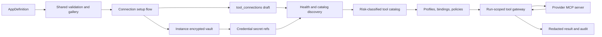
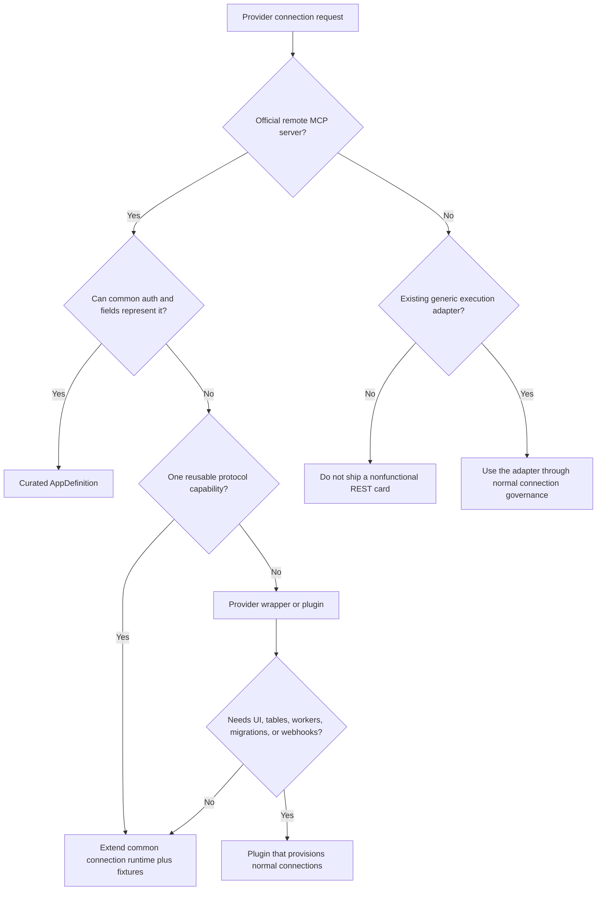
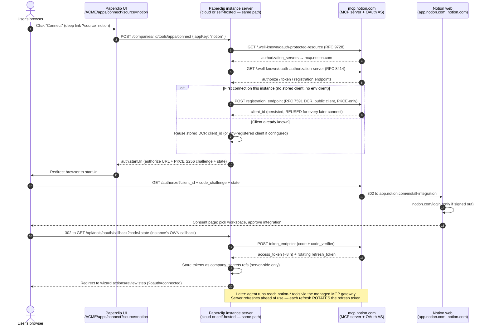

# Connection Authoring Runbook

Audience: agents and engineers researching, implementing, testing, reviewing,
and shipping Paperclip app connections.

Status: canonical end-to-end authoring guide for Apps v2 catalog connections.

For connector artwork, follow [Connector icons](./CONNECTOR-ICONS.md): fixed gray Paperclip frames, authentic vendor artwork, explicit theme variants, optical fit and exact provenance. Brand-library additions do not activate connectors. Use the shared registry/resolver and branding generator; do not introduce per-screen logos or outer-surface overrides.

This runbook is the repeatable, agent-executable procedure for adding a vendor
to the Apps catalog as data, not as a plugin. The architecture, reuse-path
classification, credential boundaries, and production validation requirements
are specified below so contributors can implement a connector without access
to an internal issue tracker.

For chat and email setup, account linking, and ongoing configuration, also follow
[Chat connector UX](./CHAT-CONNECTOR-UX.md). It covers step navigation, footer
layout, credential instructions, provider handoffs, identity linking, optional
message tests, and management pages, with examples for other providers.

Use it when Paperclip acts on an external system through a governed connection: a stored credential, a capability catalog, access profiles and policy rules, and audit. Inbound integrations, such as an external client acting on Paperclip, use gateway or webhook guidance instead.

**A catalog entry is a convenience layer, not a prerequisite.** An operator can connect any
standards-compliant remote HTTP MCP server from **Connect your own MCP server**
or **Paste a config** with no Paperclip code change at all — including servers
that need browser sign-in. Those two routes are the documented baseline; see
[Connecting any remote MCP server](./GENERIC-REMOTE-MCP.md).

Write a catalog entry when Paperclip should *promote* a vendor: branding, tailored
fields, field validation, scoped defaults, and support copy. A definition adds
those conveniences and nothing else. It must not create a second connection,
change ownership, or be necessary for health, catalog, or governance — a curated
route and the generic route converge on the same connection and review pipeline.

Every connector built with this playbook is a **plane P2** connection — a
resource credential governed by the Paperclip instance, never a sign-in
authenticator. The default durable authority is the instance vault. Reviewed
remote MCP methods may opt in to [Vercel Connect](./VERCEL-CONNECT.md), where
durable provider credentials remain in the operator's Vercel account and
Paperclip resolves short-lived tokens at invocation time. Before writing a
connector, read [Identity vs. connections](./README.md#identity-vs-connections)
for background. The boundary is mandatory: sign-in authenticates a person;
a resource connection authorizes external work; Login with Paperclip issues
first-party identity tokens to registered clients. Sign-in tokens are never
reused as resource tokens, and `id.paperclip.ing` never stores resource tokens
or hosts a connections hub. Keep company-scoped connection credentials and
agent access under the instance's connection governance.

AI provider credentials use the same vault, applications, grants, installations,
and delegation model with `connectionPurpose: ai` and `transport: runtime_auth`.
They authenticate provider execution and never enter MCP discovery or tool/channel
execution. Extend the provider's existing catalog entry with typed AI methods;
reuse the existing login controllers. See [AI Connections](./AI-CONNECTIONS.md)
for compatibility, personal defaults, resolver isolation, and legacy adoption.

## Contents

- [Mental model and support matrix](#mental-model-five-independent-axes)
- [Setup-to-runtime architecture](#architecture-from-setup-to-agent-call)
- [Secret storage and lifecycle](#secret-storage-and-lifecycle)
- [Current access defaults](#current-default-access-policy)
- [Golden-path agent tutorial](#golden-path-agent-tutorial)
- [Connection UX and user journeys](#connection-ux-and-user-journeys)
- [Chat and email connector UX](./CHAT-CONNECTOR-UX.md)
- [Production validation evidence](#step-9-align-with-production-validation)
- [AppDefinition field reference](#appdefinition-field-reference)
- [Troubleshooting](#troubleshooting-and-failure-classification)
- [Definition of done](#definition-of-done)
- [Detailed design checklist](#detailed-design-checklist)
- [Hosted MCP and OAuth protocol notes](#mcp-direct-connections-hosted-mcp--oauth)
- [Connection proposal template](#template)
- [Linear worked example](#appendix-linear-dry-run)
- [Notion DCR worked example](#appendix-notion-dry-run-mcp-direct-with-dcr)

## Output

A complete connector proposal produces:

- A catalog manifest entry with user-facing app metadata.
- Transport and auth configuration.
- Credential secret refs into `company_secrets`; never raw env values.
- Action catalog metadata with risk classes, schemas, resource filters, and quarantine defaults.
- Default profile and policy behavior for read, write, and destructive actions.
- A smoke checklist following [production validation](#step-9-align-with-production-validation): connect,
  discover catalog, allowed read call, correctly governed write call,
  denied/quarantined call when the method declares one, revoke, and audit
  evidence.

## Use This Document As The Checklist

An agent implementing a connection should be able to begin with only a provider
name and this document. Work in order. Do not jump from finding an MCP URL to
adding a store card; the research, credential, risk, branding, deterministic
test, live proof, and PR steps are all part of the feature.

The shortest valid implementation usually changes these files:

```text
scripts/ingest-app-definitions.mjs                # human-authored definition source
packages/shared/src/app-definitions/<slug>.json  # generated definition
packages/shared/src/app-definitions.generated.ts # generated registry
ui/public/brands/apps/<slug>.svg                  # official, sanitized mark
ui/public/brands/apps/manifest.json               # runtime branding paths
packages/shared/src/app-definitions.test.ts       # manifest/provider assertions
```

Add server or UI code only when the provider cannot be represented by the
existing contract. Prefer extending one generic capability with fixtures over
adding a provider-name branch. Provider branches are justified for behavior
that cannot be inferred safely, such as a provider's reviewed risk exceptions,
permanently blocked actions, or a protocol-required managed argument.

The rest of this document has three levels:

1. **Mental model and support matrix** — choose the right connection type.
2. **Golden-path tutorial** — research, implement, test, prove, and submit.
3. **Reference and appendices** — field semantics and worked examples.

## Mental Model: Five Independent Axes

Do not describe a connection as merely "an OAuth connection" or "an MCP
connection." OAuth is authentication. MCP is transport. A complete method
chooses all five axes below.

| Axis | Current values | Question |
| --- | --- | --- |
| Transport | `mcp_remote`, `local_stdio`, `rest_api` | How does Paperclip reach actions? |
| Authentication | `oauth`, `api_key`, `none` | How does the provider authorize requests? |
| OAuth client ownership | `dcr`, `customer`, `platform_shared`, `platform_provisioned` | Who supplies and controls the OAuth client registration? |
| Credential source | `paperclip_vault`, reviewed `vercel_connect` | Where does durable provider credential material live? |
| Grant identity | `organization`, `user`, `agent` | Does the credential act for the company, one person, or one dedicated agent? |

These axes produce combinations such as:

- Remote MCP + DCR OAuth + Paperclip vault + organization identity: Jira.
- Remote MCP + customer OAuth app + Paperclip vault: Asana.
- Remote MCP + DCR or customer OAuth app: Notion and PostHog.
- Remote MCP + API key in an HTTP header: Mem0 and PagerDuty.
- Remote MCP + secret-bearing provider-generated URL: Zapier.
- Remote MCP + no auth + required tenant field: Shopify.
- Remote MCP + Paperclip-managed OAuth client + per-user grant: Google
  Workspace MCP previews.
- Remote MCP + Paperclip-managed OAuth client + personal or dedicated-agent
  grant: GitHub. See [GitHub managed connection](./GITHUB.md).
- Local stdio MCP + approved command template: the Google Sheets robot flow and
  development fixtures.
- REST API parent + provider-specific child-session bridge: Composio. This is a
  specialized implementation, not a generic REST catalog recipe.

### Transport support and boundaries

| Transport | Manifest-only? | Runtime status | Authoring rule |
| --- | --- | --- | --- |
| `mcp_remote` | Yes | First-class discovery, health, catalog, gateway, test, OAuth, and credential projection. | Default for official hosted MCP servers. |
| `local_stdio` | Only with an approved template | First-class only through registered templates and a trusted runtime host. Disabled in authenticated/public deployments without that host. | Never put an arbitrary command in an `AppDefinition`. Register and test a template. |
| `rest_api` | No, not generally | Not exposed through the connected MCP gateway. Composio is a provider-specific parent that creates MCP-capable children. | Do not add a generic REST/API card until an execution adapter or wrapper exists. |

`api_key` in a method means an authentication mode; it does not mean the
transport is a REST API. Most current API-key catalog entries authenticate a
remote MCP server.

Anthropic accounts use the `runtime_auth` AI connection methods. Its obsolete
`api-key` REST tool method is no longer offered. Existing unsupported REST tool
connections fail health and catalog checks with HTTP 422 and
`tool_connection_transport_unsupported`; they never use local stdio templates
or report a successful MCP probe. Add the provider through its supported account
flow, then remove the obsolete connection. This does not transfer credentials
or grants automatically.

For `mcp_remote`, header credentials and secret-bearing generated URLs have the
complete generic runtime path. The schema also names `query`, `body_json`, and
`env` key placements for specialized transports, but accepting a value in the
schema is not proof that the remote MCP gateway projects it. Do not ship one of
those placements without tracing the invocation path and adding an end-to-end
fixture. `env` belongs primarily to approved local stdio templates.

### Authentication support matrix

| Pattern | Definition shape | What the user sees | What Paperclip stores |
| --- | --- | --- | --- |
| Automatic OAuth | `auth: "oauth"`, `ownershipModes: ["dcr"]` | Browser sign-in | DCR/CIMD client binding plus token secret refs. |
| Automatic OAuth with own-app escape hatch | `ownershipModes: ["customer", "dcr"]` | Recommended browser sign-in; own client under **Advanced** | Same as automatic, or supplied client ID plus encrypted client secret. |
| Customer OAuth only | `ownershipModes: ["customer"]` | Required client ID and optional/required client secret, then browser sign-in | Client ID in redacted config; client secret and provider tokens as secret refs. |
| Paperclip-managed OAuth | `oauthStrategy: "paperclip_cloud_connector"`, `connectorProfile`, `platform_shared` | Browser sign-in through Paperclip Cloud | Provider tokens still land in the instance vault on a user grant. Cloud handles the fixed provider callback but does not persist plaintext credentials; Paperclip ID remains identity-only. |
| API key/PAT | `auth: "api_key"`, `credentialFields`, `keyPlacement` | Write-only credential field | Encrypted secret version plus placement-only refs. |
| Generated URL | `auth: "none"`, no fixed URL/default template | Paste provider-generated MCP URL | Public URL shape in config; full secret-bearing URL in the vault. |
| No auth | `auth: "none"`, fixed `serverUrl` or validated `serverUrlTemplate` | Zero fields or only required tenant/resource fields | No provider credential. |

### OAuth client resolution order

For standard OAuth methods, Paperclip resolves a client in this order:

1. Deployment-preconfigured provider client.
2. Client ID Metadata Document (CIMD), when advertised and the instance has a
   public HTTPS URL.
3. Dynamic client registration (DCR/RFC 7591), when advertised and allowed by
   the curated method.
4. A customer-created client ID and secret supplied through setup.

For a curated method, `ownershipModes` is an allowlist. A method containing
only `customer` must not silently fall through to generic DCR. A method
containing `dcr` permits the automatic CIMD/DCR tiers. Deployment-preconfigured
credentials still take precedence when present.

### Credential source is not OAuth client ownership

`ownershipModes` says who owns the OAuth client registration. It does not say
where provider access tokens live. By default, access tokens, refresh tokens,
client secrets, and API keys live in the Paperclip instance vault.

`credentialSource: "vercel_connect"` is a separately reviewed exception for
specific methods. Such a connection stores a Vercel connector reference and no
Paperclip provider secret refs. Never make a method accept both sources in the
same connection, and never infer Vercel eligibility from a provider name.

## Architecture From Setup To Agent Call



The agent never receives a durable provider credential. A run receives a
Paperclip gateway capability. At invocation time the gateway rechecks company,
connection, grant, catalog, profile, policy, and run state; resolves the needed
secret version; projects only the reviewed headers/arguments; calls the
provider; and writes redacted audit evidence.

## Secret Storage And Lifecycle

Connection credentials use the same secrets architecture as agent, project,
and routine environment bindings. They are not files in a provider-named
folder.

The durable pieces are:

- `company_secrets`: secret identity, company/user scope, provider metadata,
  and ownership.
- `company_secret_versions`: encrypted or externally referenced version
  material.
- `company_secret_bindings`: which connection/grant/config path may resolve a
  secret.
- `secret_access_events`: audited resolution activity.
- `tool_connections.credentialSecretRefs` and
  `connection_grants.credentialSecretRefs`: value-free pointers and config
  paths.
- `tool_connections.credentialRefs`: value-free projection shape such as the
  HTTP header name and prefix.

On the default local provider, values are encrypted with the instance master
key under `~/.paperclip/instances/<instance>/secrets/master.key`. A usable
backup requires both the database and this key. Hosted provider-vault behavior
is configured under Company Settings; the connection contract remains refs,
not raw values.

Credential handling by pattern:

- API keys are created through `secretService.create`, then only their refs are
  attached to the connection or selected grant.
- OAuth access and refresh tokens use `oauth.access_token` and
  `oauth.refresh_token` refs. Refresh rotates versions under a lease so two
  servers do not replay a rotating refresh token.
- Customer OAuth client secrets use an encrypted `oauth.client_secret` ref.
  Client IDs are identifiers and may remain in redacted connection config.
- A generated URL containing credentials is split. Paperclip stores a safe URL
  for display/routing and vaults the complete URL. The gateway verifies that
  the secret URL still matches the public URL before use.
- Personal credentials live on a `user` grant and user-scoped secret rows.
  Organization credentials live on the connection/default organization grant.
  Choosing "Just me" must never first create or silently fall back to a shared
  organization credential.
- Failed setup removes newly created orphan secrets. Removal/revocation clears
  OAuth state, grant credentials, gateway access, and owned secret material;
  shared secrets used by another consumer are retained.

Never put raw credentials in any of these places:

- `AppDefinition` JSON or the ingestion script
- connection `config` or `transportConfig`
- application metadata
- agent, project, or routine plain environment values
- test fixtures committed to git
- issue comments, activity details, screenshots, traces, HAR files, or console
  output
- PR descriptions or live-proof evidence

Tests must assert absence, not merely avoid printing a secret during the happy
path.

## Current Default Access Policy

The current product behavior is encoded by `recommendedDefaultsForApp` in
`packages/shared/src/app-definitions.ts`:

- Every discovered action is enabled during successful setup.
- Every active action defaults to **Allowed**, including `write` and
  `destructive` actions, for every connection method.
- Permanently blocked provider actions stay disabled.
- Provider/schema-specific changed-tool quarantine remains a separate catalog
  concern; do not turn writes Off as a substitute for correct risk
  classification.

This is an opt-in restriction model. Finishing a connection is still limited to
a board user with connection-configuration access, commits the selected action
IDs to an auditable profile, and leaves **Ask first** available for any action.
The open default changes the initial policy; it does not create a route around a
policy the operator has applied.

If a destructive provider cannot be safe with those defaults, add a narrowly
reviewed provider policy with tests. Do not hide a dangerous tool by
misclassifying it as read, and do not silently change global defaults in a
provider PR.

## Golden-Path Agent Tutorial

This is the implementation sequence an autonomous coding agent should follow.

### Phase 0: Establish scope and preserve the worktree

1. Read `AGENTS.md`, `doc/GOAL.md`, `doc/PRODUCT.md`,
   `doc/SPEC-implementation.md`, `doc/DEVELOPING.md`, and `doc/DATABASE.md`.
2. Read this runbook, [the connections overview](./README.md), and
   [the security threat model](./SECURITY-THREAT-MODEL.md).
3. Inspect `git status --short`. Existing changes belong to the user or another
   task. Do not reset, rewrite, or format unrelated files.
4. Decide whether the request is research-only, definition-only, or a new
   runtime capability. A store card is not evidence of runtime support.
5. Write acceptance criteria before editing. At minimum: actionable store card,
   setup completes, credentials are vaulted, tools list, one safe read runs,
   refresh/reconnect works, revoke blocks use, and no secret appears in API or
   logs.

### Phase 1: Research the provider from primary sources

Use current official provider documentation and live protocol metadata. Search
results and Vercel captures are leads, not authority.

Record this evidence:

- Official product/docs URL and date verified.
- Exact MCP endpoint, including path and trailing-slash behavior.
- Whether the endpoint uses Streamable HTTP or an older SSE path.
- Unauthenticated response status and `WWW-Authenticate` challenge.
- RFC 9728 protected-resource metadata URL.
- RFC 8414/OIDC authorization-server metadata URL and exact issuer.
- Authorization, token, registration, and revocation endpoints when published.
- PKCE support and token endpoint auth methods.
- Whether CIMD or DCR is actually advertised.
- Required scopes. Separate documented minimum scopes from the full discovery
  list.
- Access/refresh lifetime, rotation behavior, and terminal refresh errors.
- Redirect URI constraints: HTTPS, loopback HTTP, exact callback allowlisting,
  or reviewed-client requirements.
- Normal prerequisites: account, paid plan, tenant feature flag, administrator
  consent, preview enrollment, region, project/site identifier.
- Whether Paperclip itself needs provider approval. Customer-admin approval is
  self-serve; provider approval of Paperclip is not.
- Tool/action inventory, provider annotations, known destructive actions, and
  resource boundaries.
- Revocation procedure and whether a provider endpoint exists.

Safe research may fetch public metadata, but it must not perform dynamic client
registration. Paperclip's catalog preflight is intentionally non-registering:

```text
GET /api/companies/:companyId/tools/apps/:galleryKey/preflight?methodKey=<method-key>
```

Registration and consent happen only after an explicit Connect action. If the
provider requires Paperclip approval or redirect allowlisting that a customer
cannot complete, retain the research entry with an unavailable reason and do
not expose a connect action.

For researched self-serve MCP providers, update the durable evidence ledger in
`packages/shared/src/self-serve-mcp-research.json` and the dated program plan
when eligibility or endpoints change.

### Phase 2: Choose the lightest valid product shape

Use this decision tree:



Default to an `AppDefinition` for hosted remote MCP. Use a plugin only for
custom product surfaces, tables, workers, migrations, ingestion loops,
webhooks, or other real code ownership. A plugin still provisions normal
connections and cannot bypass secrets, grants, profiles, policy, gateway, or
audit.

### Phase 3: Design methods and the setup experience

For every real user choice, create a separate method. Do not create methods for
choices Paperclip can infer.

Good separate methods:

- US OAuth versus EU API-key endpoints.
- Read versus write capability profiles when the provider publishes distinct
  servers or scope sets.
- Standard browser sign-in versus a materially different API-key path.
- Distinct provider modes such as Postman's minimal, code, and full catalogs.

Avoid separate methods for:

- DCR versus CIMD. Paperclip chooses automatically.
- DCR versus a customer-owned OAuth app when both reach the same endpoint.
  Keep browser sign-in recommended and fold "use your own OAuth app" under
  **Advanced**.
- Optional project filters, read-only switches, or response tuning. These are
  advanced fields with safe defaults.

The default setup screen should ask only for information required to make the
connection work or enforce a real tenant boundary. Follow these rules:

- Put optional narrowing in fields marked `advanced: true`.
- Give hidden fields a `defaultValue`; never create a hidden required field the
  server cannot fill.
- Use `setupPrerequisite` for steps that must happen before credentials or
  consent, such as preview enrollment or making a storefront public.
- Put account/plan/admin limitations in `warnings` and `guidanceMd`.
- Give every method a meaningful `label`, `whenToUse`, exact endpoint, risk
  tier, and official `consoleLinks`.
- Use `capabilityProfile` for user-facing mode names. Do not infer defaults from
  array order when one mode is the useful write-capable choice.
- Use `grantKinds: ["user"]` for providers that only support personal delegated
  identity.
- Use `requiredResourceFilters` as reviewed policy metadata, but remember a
  label is not enforcement. The provider, gateway, wrapper, or managed header/
  query projection must enforce the boundary.

#### Connector-provided skills and tools

Connectors may contribute bundled skills with optional native tools. Keep provider-specific
instructions out of the universal Paperclip skill and provider-specific tools
out of the universal runner catalog. Use the trusted connector contribution
registry in `server/src/services/connector-runtime.ts`; AgentMail is the first
consumer. This registry describes bundled server implementations, not executable
code or skill URLs supplied by a credential or external message.

For each contribution, declare its connector key, bundled skill, namespaced tool
definitions, resource-assignment resolver, and execution handler. Use names such
as `agentmail_send` rather than extending core tools with provider-specific
branches. Existing MCP connectors continue to use their normal MCP tool catalog;
they do not need a duplicate native wrapper just to supply a skill.

**Resolve eligibility from current assignments and access.** An AgentMail account
credential alone does not give an agent email capabilities. An active inbox
assigned to that agent does, provided both the inbox connection and saved
credential access remain authorized and the experimental chat-connector flag is
on. Other connectors must define an equally concrete assignment rule. Keep every
lookup company-scoped. Revoked grants, disabled connections, removed assignments,
and experimental gates must remove the contribution. Fail closed on lookup errors.

**Install skills transparently through the existing runtime skill path.** Merge
system-managed contributions with the agent's chosen skills for each run, without
writing them into its saved skill preferences. Deduplicate multiple resources
from the same connector into one skill. Include only authorized resource context,
never provider secrets; treat resource values as data. Supply the short skill
description for discovery and keep detailed instructions in the skill. The same
resolved set must reach local CLI adapters, sandbox adapters, and native runners.
Adapters with isolated skill delivery receive the bundle. Adapters that install
into shared user directories receive the same assigned skill in the run prompt,
including resumed turns, without writing connector files into that directory.
Manual skill-sync operations must also exclude automatic connector bundles.
The agent Skills page should identify automatic contributions and explain that
assignment controls them; they are not independently enabled/disabled there.

**Bind tools to the same resolved skill assignment.** Native sessions advertise
only contributions present in their pinned runtime skill bundle. Include skill
content, resource assignments, and tool revisions in session compatibility so a
changed assignment cannot reuse stale declarations. Revalidate live assignment,
company/task/run authority, and configured action policy on every execution.
Removing a tool from discovery alone is not revocation enforcement. Retained
provider sessions and previously issued calls must fail after access is revoked.

**Avoid shared runtime contamination.** Do not install assignment-specific skills
into a company-wide or user-wide runtime home. Use immutable skill bundles and
scoped runtime directories. Codex CLI connector runs use a separate home per
agent and connector-skill revision, seeded from the selected model credential
home. Disconnecting returns to a runtime without those skills; another agent must
never inherit them. Preserve explicit model identity and normal session recovery.

Required tests cover no assignment, credential access without a resource,
authorized assignment, multiple resources with one skill, cross-company access,
revocation during a retained run, disabled flags/connections, and reassignment.
Verify skill installation and removal in both CLI/sandbox and native execution,
including tool discovery, runtime cache changes, and absence of provider secrets.
Exercise an actual connector operation through the contributed tool, not just
its declaration. Record which runtime paths were tested live versus deterministically.

#### Connection UX and user journeys

For chat and email onboarding or management screens, apply
[Chat connector UX](./CHAT-CONNECTOR-UX.md) alongside this section. Keep the
provider's actual capabilities and the distinction between resource setup,
personal identity linking, and company membership explicit. The chat wizard may
choose its agent before app creation; a separate agent-resource assignment
wizard, described below, applies when that assignment is an independent action.

Design the whole journey, from finding the app to doing useful work with an
agent. A successful credential exchange is only one step. Describe who the
user is, where they start, what they want to accomplish, and where they will
see the result. Walk through first use, returning use, and recovery from a
failed action. For messaging connections, cover both agent-initiated work and
incoming messages that start or continue work.

**Separate connecting from assigning an agent a resource.** First configure
who can use the connection and authenticate with the provider. If the feature
also assigns a resource to a specific agent, offer a second wizard from the
connection's Permissions view after the connection is saved. Give its entry
point a prominent, concrete action name. For example, AgentMail uses “Give an
agent an email address,” followed by Agent → Email address → Review. Reuse the
saved credential; do not ask for the API key again. Use the existing numbered
step pattern, sensible defaults, Back and Cancel, and a clear completion state.
Do not add a second wizard when there is no separate assignment to configure.

Let the operator search eligible company agents, including agents not yet on
the connection's allowed list. When assigning a resource also grants connection
access, make that consequence clear and persist the grant through the existing
access machinery. Respect the operator's authority to grant access, and show
the selected agent's avatar and name.

**Use the minimum text needed to make the next action clear.** Prefer familiar
controls and precise labels over explanatory paragraphs. Remove repeated
headings, redundant access summaries, implementation details, and reassurance
that does not help the user decide or act. Keep necessary warnings, meaningful
consequences, and actionable errors. Put optional expert settings under a
collapsed Advanced disclosure. Link to provider-owned administration, such as
AgentMail allowlists, rather than rebuilding it in Paperclip.

**Keep ongoing interactions in Paperclip tasks.** Connections are where users
set up access and configuration; tasks are where they work with agents. Design
what happens after setup: how an agent invokes the connection, where incoming
work lands, how follow-ups stay associated with that work, and how users see
success or recover from failure. Avoid introducing a separate mailbox or
provider dashboard as the primary interaction surface.

Use rich cards in the task feed when they make external activity easier to
understand. An email card, for example, can show the sender, recipients, body,
attachments, and delivery state. Keep external activity distinguishable from
internal discussion; a task comment or agent progress update must not imply
that an external action occurred. Reuse existing task-feed components and
preserve one visible record per external event.

**Make interactive Storybooks for setup and actual use.** Include the catalog
card, access and credential steps, any agent-resource wizard, and the task
journeys after setup. Provide a clickable walkthrough plus focused stories for
important steps, loading, errors, and recovery. Use realistic fixtures and
clearly label simulated actions. Reuse production components as implementation
lands, and replace obsolete stories so the examples describe the current
experience. Storybooks support design review and deterministic interaction
tests; they do not replace a real-provider browser test.

### Phase 4: Add official branding before exposing the app

Every store-visible provider needs an official local mark. A letter tile is
only a runtime image-failure fallback.

1. Find the provider's official brand kit, product site, or official repository.
2. Prefer an official SVG. Use a high-resolution transparent PNG only when no
   official SVG is available.
3. Do not use Google's favicon proxy, scrape a random icon site, or generate an
   imitation.
4. Sanitize SVGs. Reject scripts, `foreignObject`, event-handler attributes,
   external executable content, or unsafe references.
5. Save assets under `ui/public/brands/apps/`. Add a `-dark` variant only when
   the normal mark loses contrast in dark mode.
6. Add the provider to `ui/public/brands/apps/manifest.json` with slug, name,
   local asset, optional dark asset, visibility, and optional aliases. Keep source
   URLs and verification notes in the review record, outside the public manifest.
7. Let the ingestion script derive `branding.logoUrl` and `darkLogoUrl` from the
   runtime manifest.

The manifest test decodes PNG headers, requires at least 128 by 128 pixels,
sanity-checks SVG markup, verifies files exist, and requires store-visible
definitions and visible manifest entries to match exactly.

### Phase 5: Author the definition at the durable source

The checked-in provider JSON files are generated. Do not edit one and stop.

1. Add or update the provider in `scripts/ingest-app-definitions.mjs`.
2. Update `packages/shared/src/self-serve-mcp-research.json` when it belongs to
   that program.
3. Add branding provenance and assets first; generation fails closed when
   branding is missing.
4. Regenerate definitions:

```sh
pnpm connections:ingest-app-definitions
```

The default ingestion corpus is the Vercel research checkout at
`../../paperclip-content/research/connections/vercel/templates`. Override it
when necessary:

```sh
PAPERCLIP_CONTENT_TEMPLATES=/absolute/path/to/templates \
  pnpm connections:ingest-app-definitions
```

Generation currently validates the 99-capture corpus and rewrites provider
JSON, the generated TypeScript registry, and the ingestion report. A PR must
contain the human-authored source and generated output. Inspect the diff after
generation; do not accept unrelated provider churn.

Minimal automatic OAuth example:

```json
{
  "key": "mcp-oauth",
  "label": "Sign in with Example",
  "transport": "mcp_remote",
  "auth": "oauth",
  "ownershipModes": ["dcr"],
  "whenToUse": "Use browser sign-in for the hosted MCP server.",
  "defaults": {
    "serverUrl": "https://mcp.example.com/mcp",
    "scopesHint": ["example.read", "example.write"]
  },
  "guidanceMd": "Connect the workspace agents should use.",
  "consoleLinks": {
    "docs": "https://docs.example.com/mcp"
  },
  "riskTier": "S3"
}
```

Minimal customer OAuth example:

```json
{
  "key": "mcp-own-oauth",
  "label": "Use your own OAuth app",
  "transport": "mcp_remote",
  "auth": "oauth",
  "ownershipModes": ["customer"],
  "whenToUse": "Register an OAuth app, then enter its client ID and secret.",
  "defaults": {
    "serverUrl": "https://mcp.example.com/mcp"
  },
  "guidanceMd": "Register Paperclip's callback URI in the provider console.",
  "consoleLinks": {
    "register": "https://example.com/developers/apps",
    "docs": "https://docs.example.com/mcp/oauth"
  },
  "riskTier": "S3"
}
```

Minimal API-key example:

```json
{
  "key": "mcp-api-key",
  "label": "Use an API key",
  "transport": "mcp_remote",
  "auth": "api_key",
  "ownershipModes": ["customer"],
  "whenToUse": "Use a restricted key from the provider console.",
  "defaults": {
    "serverUrl": "https://mcp.example.com/mcp"
  },
  "credentialFields": [
    {
      "key": "authorization",
      "label": "Example API key",
      "type": "password",
      "required": true,
      "placeholder": "ex_...",
      "secret": true
    }
  ],
  "keyPlacement": {
    "location": "header",
    "name": "Authorization",
    "prefix": "Bearer "
  },
  "guidanceMd": "Create a key limited to the resources agents need.",
  "riskTier": "S3"
}
```

Generated-URL example:

```json
{
  "key": "generated-url",
  "label": "Paste generated MCP URL",
  "transport": "mcp_remote",
  "auth": "none",
  "ownershipModes": ["customer"],
  "whenToUse": "Paste the complete server URL generated by the provider.",
  "defaults": {},
  "guidanceMd": "Create a server in the provider, then paste its URL.",
  "riskTier": "S3"
}
```

No-auth tenant-template example:

```json
{
  "key": "public-mcp",
  "label": "Public storefront",
  "transport": "mcp_remote",
  "auth": "none",
  "ownershipModes": ["customer"],
  "whenToUse": "Connect a public tenant endpoint.",
  "defaults": {
    "serverUrlTemplate": "https://{tenantDomain}/api/mcp"
  },
  "tenantFields": [
    {
      "key": "tenantDomain",
      "label": "Tenant domain",
      "type": "text",
      "required": true,
      "placeholder": "store.example.com",
      "validation": {
        "pattern": "^[A-Za-z0-9.-]+$",
        "maxLength": 255
      }
    }
  ],
  "guidanceMd": "Enter the permanent public tenant domain.",
  "riskTier": "S2"
}
```

Use `defaults.toolArgumentDefaults` only for required, provider-documented
protocol metadata that Paperclip owns, not to force a user's business input.
Managed arguments are deep-merged after caller input and win on collisions; the
same fields are removed from the agent-visible and Test-tab input schema.

### Phase 6: Add generic runtime support only when needed

Before adding code, prove the manifest cannot express the provider.

Common extension points:

- `packages/shared/src/types/app-definition.ts` and
  `packages/shared/src/validators/app-definition.ts` for a reusable manifest
  capability.
- `normalizeConnectionMethodConfig` for validated tenant/extension fields and
  header/query projection.
- `projectedConnectionHeaders`, `projectedConnectionToolArguments`, and
  `projectedConnectionToolInputSchema` for server-managed request material.
- OAuth discovery/client/token/refresh functions in
  `server/src/services/tool-access.ts`.
- MCP invocation in `server/src/services/tool-gateway.ts`.
- `classifyRisk` only for reviewed provider exceptions that generic annotations
  and name classification cannot represent safely.
- `ConnectionSetupFlow` only when a schema-driven setup capability genuinely
  cannot render the flow.

When adding a reusable field:

1. Update shared TypeScript types.
2. Update the Zod validator with cross-field invariants.
3. Update server normalization and invocation projection.
4. Update UI rendering and request types.
5. Add fixture tests for valid, invalid, redacted, reconnect, and invocation
   behavior.
6. Document the new field here.

Keep `ConnectToolApp` synchronized across UI and server. Never create a UI-only
request shape that drops `connectionMethodKey`, `oauthClient`, `grantKind`, or
credential source data.

### Phase 7: Write deterministic tests before using a real account

At minimum, add or update tests in these layers:

**Manifest**

- Schema validates.
- Slug and method keys are unique and stable.
- Endpoint, scopes, ownership modes, risk tier, prerequisite, and field
  placement equal the reviewed values.
- Store visibility matches the intended rollout state.
- Official local branding and provenance exist.
- Hidden fields have defaults; required fields have placeholders.
- The default setup path asks only for truly required configuration.

**Server/service**

- Method selection is required when multiple methods are real choices.
- Tenant fields normalize, validate, and reach the exact URL/header/query.
- Unknown config fields are rejected.
- API keys/client secrets/tokens become encrypted refs and never appear in the
  response.
- Failed setup removes newly created secrets and draft rows when appropriate.
- DCR, CIMD, and manual-client paths use fixture metadata and never require a
  real provider.
- Scope widening beyond `scopesHint` is rejected.
- OAuth state, actor/session, issuer, redirect, resource, and company bindings
  fail closed.
- Refresh rotates safely; terminal `invalid_grant` requires reauthorization.
- Health, catalog refresh, reconnect, removal, and secret cleanup work.
- SSRF, private/link-local address, redirect, header-name, and header-value
  protections remain intact.
- Company A cannot observe or invoke company B's connection.
- Managed arguments/headers cannot be spoofed by caller input.
- Risk exceptions classify every reviewed tool correctly.

**UI**

- Browse has an actionable route for an available capability-backed definition.
- Hidden/unavailable providers do not show a dead Connect button.
- Direct `/apps/connect?source=<slug>` opens the selected provider, not the
  generic gallery.
- Automatic OAuth, customer OAuth, API key, generated URL, no-auth, required
  tenant field, prerequisite, warning, and Advanced disclosures render as
  declared.
- Finish setup resumes the exact draft using `resumeConnectionId`.
- Optional customer OAuth details stay folded when automatic OAuth exists.
- Setup success leads to the connection's Test page, or to Permissions when a
  separate agent-resource assignment is the next step. Follow the
  [connection UX guidance](#connection-ux-and-user-journeys).
- Interactive Storybooks cover setup and ongoing task interactions, including
  relevant failure states; the walkthrough matches the implemented journey.
- Missing images fall back at runtime, while manifest acceptance still fails
  missing branding.

Useful focused command:

```sh
pnpm exec vitest run \
  packages/shared/src/app-definitions.test.ts \
  server/src/__tests__/tool-access-service.test.ts \
  server/src/__tests__/generic-mcp-connection.test.ts \
  server/src/__tests__/tool-connection-removal.test.ts \
  ui/src/pages/apps/AppsConnect.test.tsx \
  ui/src/pages/apps/Browse.test.tsx
```

Use `-t '<provider or behavior>'` while iterating, then run each affected file
without a test-name filter before handoff.

Targeted type checks:

```sh
pnpm --filter @paperclipai/shared typecheck
pnpm --filter @paperclipai/server typecheck
pnpm --filter @paperclipai/ui typecheck
```

If UI code changed, also run:

```sh
pnpm check:token-gates
```

### Phase 8: Start an isolated instance and verify the setup UI

Use a worktree-local instance; never point two worktrees at the same embedded
database.

```sh
paperclipai worktree init
pnpm dev
```

Confirm the actual port with `pnpm dev:list` and verify health:

```sh
curl -fsS http://localhost:<port>/api/health
curl -fsS http://localhost:<port>/api/companies
```

Walk the user path:

1. Open `/<company-prefix>/apps`.
2. Confirm branding, copy, visibility, ordering, and Connect state.
3. Open `/<company-prefix>/apps/connect?source=<slug>` directly.
4. Verify prerequisites and warnings appear before credentials/consent.
5. Exercise every method. Do not test only the default method.
6. Cancel or interrupt once. Confirm the store shows **Finish setup** and that
   it returns to
   `?source=<slug>&resume=<connection-id>` without creating another draft.
7. Complete setup. Confirm the connection is active/healthy and opens
   `/<company-prefix>/apps/<connection-id>/permissions`, then use the action's
   **Test** button.

For OAuth, the instance callback must be browser-reachable and must match the
provider registration. Loopback HTTP is acceptable only when provider and
Paperclip redirect policies permit it. Browser-started setup on an authenticated
private instance automatically uses the same-origin HTTPS address that served
the setup page, including a Tailscale Serve address; the request must pass the
hostname and board-mutation guards. An explicit `PAPERCLIP_PUBLIC_URL` remains
available for non-browser starts and unusual proxy topologies. Internal service
hostnames are not valid browser callback origins.

Use the browser signed-in session only for an explicitly authorized live proof.
Do not inspect cookies, storage, saved passwords, or unrelated account data.

### Phase 9: Perform the real-provider proof

Deterministic fixtures prove Paperclip logic. A store-ready provider also needs
one account-bound proof for every method being exposed.

Run this exact lifecycle:

1. **Preflight** — public metadata only; no registration or credentials.
2. **Connect** — finish provider consent or enter the credential.
3. **Catalog** — list tools and compare them with reviewed expectations.
4. **Safe read** — execute one narrow, non-mutating action in the Test page.
5. **Write classification** — confirm known writes/destructive actions appear
   in the correct risk group and default policy.
6. **Agent path** — run one action through an actual agent/run-scoped gateway,
   not only the board Test helper, when the connection changes gateway logic.
7. **Refresh/reconnect** — refresh the catalog, reconnect or force a safe token
   refresh, and repeat the safe read.
8. **Revoke/remove** — revoke at the provider or remove in Paperclip. Confirm
   tools disappear or calls fail closed immediately.
9. **Reconnect after removal** — when supported, confirm the retained identity
   and history are reused rather than duplicated.
10. **Secret inspection** — inspect API responses, application logs, activity,
    audit, screenshots, and evidence artifacts for the exact canary credential.
    It must be absent.

Evidence should record only:

- provider and method key
- date, environment, endpoint origin/path, and connection ID when non-sensitive
- catalog tool names/counts and schema hashes
- policy/risk result
- redacted success/failure codes
- revoke/reconnect outcome

Do not record token values, secret-bearing URLs, authorization codes, provider
session details, personal email, tenant content, HAR files, or pre-callback
screenshots containing provider data.

When consent UI has an intentional delay or requires a real pointer/keyboard
interaction, honor that behavior before classifying it as failure. Keep provider
consent problems separate from callback, token exchange, catalog, and gateway
failures.

### Phase 10: Verify APIs and audit without exposing credentials

Useful read-only endpoints after setup:

```text
GET /api/companies/:companyId/tools/connections
GET /api/tool-connections/:connectionId
GET /api/tool-connections/:connectionId/catalog
GET /api/tool-connections/:connectionId/activity?limit=50
GET /api/tool-connections/:connectionId/grants
```

Mutating verification endpoints:

```text
POST /api/tool-connections/:connectionId/health-check
POST /api/tool-connections/:connectionId/catalog/refresh
POST /api/tool-connections/:connectionId/test-calls
DELETE /api/tool-connections/:connectionId
```

Responses may contain secret IDs, version selectors, header names, prefixes,
scope names, expiry timestamps, and redacted provider metadata. They must not
contain secret values. Logs and activity should identify the operation and
outcome without echoing provider-authored credential-bearing errors.

### Phase 11: Run the PR-ready verification ladder

Run the smallest relevant suite first, then the full ladder when the change is
ready for review:

```sh
pnpm check:token-gates
pnpm -r typecheck
pnpm test:run
pnpm build
```

Also run an affected Apps browser suite when routing, setup, OAuth popup,
finish-setup, Test page, or branding behavior changed:

```sh
pnpm test:e2e
```

Do not hide failures. Classify each as introduced, pre-existing, environmental,
or live-provider-only, and include the exact command and result in the PR.

Before staging:

```sh
git diff --check
git status --short
git diff --stat
git diff -- \
  scripts/ingest-app-definitions.mjs \
  packages/shared/src/app-definitions \
  packages/shared/src/app-definitions.generated.ts \
  ui/public/brands/apps \
  server/src/services/tool-access.ts \
  server/src/services/tool-gateway.ts
```

Review every generated change. Verify no credential, provider account data,
unrelated worktree change, or temporary evidence file is staged.

### Phase 12: Prepare and submit the pull request

1. Keep commits scoped. A typical split is definition/branding, generic runtime
   capability, and tests/docs. Do not split generated output from its source.
2. Do not commit `pnpm-lock.yaml`; GitHub Actions owns it in this repository.
3. Read `.github/PULL_REQUEST_TEMPLATE.md` immediately before writing the PR
   body.
4. Fill every required section:
   - **Thinking Path** — why this is a catalog entry, chosen transport/auth,
     research evidence, and why no lighter path works.
   - **What Changed** — manifest, branding, runtime, UI, tests, and docs.
   - **Verification** — deterministic commands plus sanitized live proof.
   - **Risks** — scopes, provider preview/admin gates, token behavior, catalog
     drift, destructive actions, and rollback/de-list plan.
   - **Model Used** — provider, exact model ID, context window, and relevant
     capabilities, or the template's human-authored value.
   - **Checklist** — every item checked truthfully.
5. In the PR, link official provider docs and exact metadata endpoints. Do not
   link only to search results or third-party tutorials.
6. Mark live proof that was not run as outstanding; never equate a mocked OAuth
   test with provider validation.
7. Do not merge as part of connection authoring unless the task explicitly
   authorizes merging.

Suggested PR verification block:

```md
## Verification

- `pnpm exec vitest run <focused files>` — passed
- `pnpm check:token-gates` — passed
- `pnpm -r typecheck` — passed
- `pnpm test:run` — passed
- `pnpm build` — passed
- Live `<provider>/<method>` proof on `<date>`:
  connect ✓, list tools ✓, safe read ✓, refresh/reconnect ✓, revoke ✓,
  secret scan ✓
```

## AppDefinition Field Reference

### App-level fields

| Field | Meaning and rule |
| --- | --- |
| `schemaVersion` | Must be `1`. Change only with a versioned migration plan. |
| `slug` | Stable lowercase kebab-case identity. Never rename after connections exist without a migration. |
| `name` | Provider/product name shown to users. |
| `description` | Plain-language outcome, not protocol marketing. |
| `categories` | One or more supported catalog categories. |
| `featured` | Optional merchandising signal, not availability. |
| `branding` | Local official `logoUrl`, optional `darkLogoUrl`; ingestion derives this from provenance. |
| `urlPatterns` | HTTPS patterns used to recognize pasted/generated provider URLs. Keep narrow enough to reject lookalikes. |
| `docsUrl` | Current official setup/protocol docs. |
| `setupPrerequisite` | A prerequisite users must understand or complete before credentials/consent. Includes CTA and optional ordered steps. |
| `redirectConstraints` | Currently `https-or-loopback-http`; fail before provider navigation when violated. |
| `methods` | Every genuinely supported connection method. At least one. |
| `availability` | Instance/provider availability and user-facing reason. Unavailable entries must not expose a dead action. |
| `ownershipAvailability` | Deployment override for ownership modes. Defaults currently enable `customer` and `dcr`, disable platform modes. |

### Method fields

| Field | Meaning and rule |
| --- | --- |
| `key` | Stable method key stored on the connection as `connectionMethodKey`. |
| `label` | User-facing method label. Required in practice when multiple methods exist. |
| `transport` | `mcp_remote`, `local_stdio`, or specialized `rest_api`. |
| `auth` | `oauth`, `api_key`, or `none`. |
| `ownershipModes` | Allowed OAuth client ownership modes; also present for non-OAuth customer configuration. |
| `oauthStrategy` | Managed broker strategy. New definitions use `paperclip_cloud_connector`; `paperclip_id_connector` is recognized only to require migration when an old grant expires. The protocols and provider clients are not interchangeable. Only valid for OAuth. |
| `connectorProfile` | Managed connector capability/scope profile, required with `oauthStrategy`. |
| `capabilityProfile` | User-facing read/write/mode grouping used for method selection. |
| `grantKinds` | Restricts identity to `organization` and/or `user`; omit for flexible methods. |
| `whenToUse` | One sentence distinguishing this method from alternatives. |
| `defaults.serverUrl` | Exact fixed endpoint. For discovery-capable OAuth, omit fixed auth endpoints. |
| `defaults.serverUrlTemplate` | HTTPS endpoint with placeholders supplied by declared tenant/extension fields. Mutually exclusive with `serverUrl`. |
| `defaults.discoveryUrl` | Provider-specific discovery override only when reviewed metadata requires it. |
| `defaults.authorizationEndpoint` / `tokenEndpoint` | Authoritative fixed endpoints. A complete pair bypasses discovery, so ship them only when the provider lacks trustworthy discovery. |
| `defaults.metadataUrl` | Authorization metadata hint. |
| `defaults.scopesHint` | Explicit reviewed allowlist. Omit scope when docs do not require one; never copy every discovered scope. |
| `defaults.oauthAuthorizationParams` | Reviewed `access_type=offline` and/or `prompt=consent` behavior. |
| `defaults.toolArgumentDefaults` | Server-owned provider protocol arguments, hidden from caller schemas and authoritative on collision. |
| `tenantFields` | Account/project/region/resource fields. Keep only required boundaries visible by default. |
| `extensionFields` | Additional method-specific configuration rendered by the same common form. |
| `configRequirements.atLeastOneOf` | Requires one of named tenant/extension fields. Every key must exist. |
| `credentialFields` | Write-only secret/non-secret credential inputs. API-key methods require them in practice. |
| `keyPlacement` | Provider request placement. Remote MCP should use the proven header path unless a new projection is implemented and tested. |
| `guidanceMd` | Setup and scoping guidance. No secrets or internal environment-variable names. |
| `consoleLinks` | Official registration, key, settings, and docs destinations. |
| `warnings` | Plan, preview, admin, financial, production-data, or destructive-action caveats. |
| `variants` | Legacy/simple variant metadata. Prefer explicit methods plus `capabilityProfile` for materially different endpoints/auth. |
| `riskTier` | S1-S4 provider/method sensitivity used for review and validation. |
| `requiredResourceFilters` | Reviewed resource boundaries. Must be backed by enforcement, not only copy. |
| `credentialSources.vercelConnect` | Reviewed services, principal modes, scopes, and header projection for the Vercel exception. |

### Field definition rules

`FieldDef` supports `text`, `password`, `textarea`, `datetime`, `select`, and
`checkbox`.

- A required non-checkbox field needs a placeholder.
- A select needs at least one option.
- A hidden field needs a default value.
- Use `secret: true` only for write-only credential input; tenant/extension
  config must never smuggle secrets into connection config.
- `advanced: true` keeps optional expert configuration folded.
- `validation.pattern` is a JavaScript regular expression string; also set a
  practical `maxLength`.
- `transport.location: "query"` modifies the normalized server URL.
- `transport.location: "header"` creates a managed, validated non-secret
  configuration header. It is separate from `keyPlacement`, which projects a
  vaulted credential.
- CSV fields deduplicate comma/newline-separated values.
- `omitFalse` prevents a false checkbox from adding a query/header value.

## Troubleshooting And Failure Classification

| Symptom | Likely layer | What to inspect |
| --- | --- | --- |
| Store says Coming soon or Connect route is dead | Definition/availability/routing | `CONNECTABLE_APP_SLUGS`, store hidden set, method capability checks, Browse tests. |
| Direct source link shows generic connection chooser | UI route state | `AppsConnect`, `ConnectionSetupFlow`, source slug lookup, availability. |
| Finish setup opens Edit config and cannot continue | Draft identity/resume | `resumeConnectionId`, stored `sourceTemplateKey`, `connectionMethodKey`, exact draft status. |
| OAuth never redirects | Method capability/client resolution | ownership modes, metadata discovery, callback origin, manual-client requirement. |
| Provider rejects redirect URI | Deployment/provider rule | actual browser origin, `PAPERCLIP_PUBLIC_URL`, `redirectConstraints`, provider app registration. |
| OAuth succeeds then connection needs reconnect | Grant/secret sync or refresh | organization versus user grant, token refs, default grant sync, expiry/refresh lease, `invalid_grant`. |
| Tools list but calls return 401 | Token audience/scope/placement | RFC 8707 resource, `scopesHint`, header prefix/name, provider endpoint path. |
| Health works but Test call fails | Gateway projection/policy | selected grant, managed headers/arguments, effective profile/policy, catalog entry risk/status. |
| Required provider boilerplate appears in Test | Managed schema projection | `toolArgumentDefaults` and `projectedConnectionToolInputSchema`. |
| API key saves but is not sent | Unsupported placement or missing ref | `credentialFieldsFor`, `keyPlacement`, connection/grant refs, gateway header resolution. |
| Config asks for project ID the provider does not require | Manifest UX | make it optional/advanced, add default, or remove it; test the zero-config path. |
| Connected card still says Connect | Identity matching | application/source slug, retained app status, connection-to-definition association. |
| New tool is classified read | Risk inference | annotations, namespaced/camelCase verb normalization, provider exception set, fixture. |
| Connection from another company is visible | Authorization bug | stop; add company-scope negative tests before any further live testing. |
| Raw credential appears anywhere | Security incident | stop, revoke/rotate it, remove evidence, trace every response/log/audit path, add a canary regression test. |

When a bug appears on one provider, first reproduce it with a fixture or a
second provider of the same auth/transport type. Fix the shared path when the
failure is generic. Keep provider workarounds narrow and documented.

## Definition Of Done

A catalog connection is ready only when every applicable item is true:

- [ ] Official docs and live metadata agree on the endpoint and auth flow.
- [ ] Self-serve/provider-approval classification is documented.
- [ ] Every exposed method has completed the full live lifecycle.
- [ ] The default path asks only for required configuration.
- [ ] Optional own-OAuth and expert fields are folded under Advanced.
- [ ] Scopes are explicit and contained; caller widening is rejected.
- [ ] Official local branding and provenance pass validation in light and dark themes.
- [ ] Ingestion source and generated definitions are synchronized.
- [ ] Credentials and tokens are stored only as encrypted/external refs.
- [ ] Shared and personal grant semantics are correct.
- [ ] Health and catalog discovery succeed.
- [ ] One safe read succeeds in the Test page and, where relevant, an agent run.
- [ ] Writes/destructive tools are correctly classified and use current tier defaults.
- [ ] Refresh, reconnect, revoke/remove, and post-removal reconnect are verified.
- [ ] Company isolation, SSRF, OAuth binding, redaction, and cleanup tests pass.
- [ ] API responses, logs, activity, and evidence contain no credential values.
- [ ] Focused tests, token gates, typecheck, test suite, and build pass or exact blockers are reported.
- [ ] PR uses every section of the repository template and links official evidence.

## Detailed Design Checklist

The golden-path tutorial above is the operational sequence. The following
steps are the design-review checklist: use them when the connection proposal
needs a more formal transport, credential, action, and governance analysis.

### Step 1: Confirm It Is A Catalog Entry

Default to a catalog entry when the vendor can be represented as metadata plus a transport:

- The connection points at a remote MCP endpoint, an approved local stdio template, or a generated shim over a documented API.
- The setup flow only needs normal fields, OAuth redirect handling, resource filters, policy defaults, and health/catalog checks.
- The vendor does not need its own database tables, background workers, custom issue-thread interactions, or dedicated UI pages.

Use a plugin only when the integration needs code that cannot fit inside the common connection model:

- Product surface: custom pages, dashboards, panes, or rich configuration UI beyond schema-driven forms.
- Data model: plugin-owned tables, migrations, or long-lived local state.
- Execution: workers, schedulers, webhooks, sync loops, file processors, or vendor-specific runtimes that are not a simple transport shim.
- Packaging: a third party wants to ship the integration as an extension package.

A plugin may bundle one or more catalog entries, but it must still create normal applications, connections, credential refs, catalog entries, profiles, policies, and audit events. Plugin code must not bypass the gateway, policy engine, `company_secrets`, changed-action quarantine, or call-event audit log.

### Step 2: Classify The Reuse Path

Classify the vendor before writing metadata. Use these definitions so rollout
planning, security review, and QA can compare providers consistently. The
examples are starting points; confirm current provider capabilities in Phase 1.

| Reuse path | Use when | Typical transport | Examples |
| --- | --- | --- | --- |
| MCP-direct | The vendor exposes an official or stable MCP server whose tools map cleanly to Paperclip grants. | `mcp_remote`; `local_stdio` only for approved trusted templates. | Linear, Notion, Sentry, Vercel, Exa, Apify, Context7. |
| OpenAPI-shim | The vendor has a documented REST/OpenAPI surface but no stable MCP server, and a generated/thin shim can expose safe actions. | Shim service or approved template that presents an MCP-compatible catalog to Paperclip. | Datadog, Apollo, QuickBooks, Ramp/Brex, Zendesk. |
| Vendor-deep-wrapper | The vendor boundary depends on app-installation tokens, event validation, rich domain semantics, resource grants, or high-risk writes. | Vendor-specific wrapper behind the same connection model. | GitHub, Slack, Google Workspace writes, Atlassian, Microsoft 365, Cloudflare, Figma, Stripe, Salesforce, HubSpot, Intercom, PagerDuty. |

Record the classification in the proposal along with the transport and the
reason a lighter path is or is not enough. For each method, also record auth
mode, credential owner, required resource filters, initial actions, webhook or
sync requirements, and security tier. A provider name alone is not a sufficient
classification: a read-only method and a method that sends messages or changes
infrastructure can have different risks.

Use the shipped definition and `recommendedDefaultsForApp` for runtime behavior.
Risk tiers describe exposure; they do not replace action policies. S1 covers
low-risk reads; S2 covers business data and narrow writes; S3 covers broad
content or operational access; S4 covers payments, external sends, production
changes, deletion, or tenant administration. High-impact methods need explicit
security review and negative access tests. Prove the transport and governance
path with narrow actions before expanding to broader capabilities.

### Step 3: Pick Auth And Credential Ownership

Choose one method auth mode:

- OAuth: delegated user or workspace authorization. The OAuth client may come
  from DCR/CIMD, a customer-created client, a deployment-preconfigured client,
  or a reviewed Paperclip Cloud connector profile. Do not assume Paperclip owns a
  shared client registration.
- API key: operator-supplied token or key. Use only when the provider supports
  a suitably restricted key and the value is stored as a `company_secrets`
  ref.
- None: public/read-only systems and provider-generated URLs. A generated URL
  may still contain a secret and must be split and vaulted.

Installation credentials such as bot tokens and GitHub App installation
tokens are provider-specific credential shapes. Model them through the generic
secret and grant architecture; do not invent an `AppDefinition.auth` value
named `app-installation` because the current schema accepts only `oauth`,
`api_key`, and `none`.

Credentials normally live in `company_secrets` with redacted metadata and
versioned material. The catalog entry records the secret binding shape, not the
secret value:

```json
{
  "credentialSecretRefs": [
    {
      "configPath": "credentials.authorization",
      "label": "Linear OAuth access token",
      "required": true
    }
  ],
  "credentialRefs": [
    {
      "name": "Authorization",
      "placement": "header",
      "key": "Authorization",
      "prefix": "Bearer ",
      "secretId": "<resolved at connect time>"
    }
  ]
}
```

Do not add durable vendor credentials to agent env, project env, runtime env, adapter config, issue comments, screenshots, logs, fixture JSON, or plugin config. Agents receive a run-scoped gateway token; Paperclip resolves the vendor credential server-side and audits the call.

For a Vercel-eligible method, add reviewed `credentialSources.vercelConnect`
metadata: allowed Vercel service identifiers, the `app` or `user` principal
mode, exact token scopes, and the header placement. This is an allowlist, not a
copy of Vercel's connector form. Only authenticated `mcp_remote` methods qualify.
Do not infer Paperclip ownership from Vercel's “Managed” label. A Vercel-backed
connection remains `customer`/`dcr` according to the existing Paperclip model.
The resulting connection has an external connector ref and zero Paperclip
credential secret refs; its grants likewise use external metadata or secret
refs, never both.

### Step 4: Author The AppDefinition

Author an `AppDefinition` as the canonical data record for the app and every supported connection method. It must explain what the operator gets without exposing protocol details in prosumer surfaces. Developer docs can mention transport, MCP, shim, and gateway terms; the Apps gallery copy should use plain app/action language.

Capture:

- `schemaVersion: 1` and a stable lowercase hyphenated `slug`, such as
  `linear`.
- `name`, `description`, `categories`, `branding`, `urlPatterns`, and
  `docsUrl`: user-facing and import metadata. Branding points to vetted local
  assets under `/brands/apps/`.
- `methods`: explicit combinations of `transport` (`mcp_remote`, `rest_api`,
  `local_stdio`), `auth` (`oauth`, `api_key`, `none`), and
  `ownershipModes` (`platform_shared`, `platform_provisioned`, `customer`,
  `dcr`).
- `credentialFields` plus `keyPlacement`: labels, write-only value fields,
  vendor-call placement, header/key name, and prefix. The saved value becomes a
  `company_secrets` ref, never a plain env/config value.
- `tenantFields` and `extensionFields`: keep unavoidable identity and resource
  boundaries in the default flow. Mark optional scope reduction, feature/tool
  filters, response modes, and transport tuning with `advanced: true`, and give
  advanced fields working defaults that do not require the operator to expand
  the disclosure.
- `defaults`: exact server/template URL, optional discovery or OAuth endpoint
  hints, a contained `scopesHint`, and only reviewed managed tool arguments.
- `grantKinds`, `oauthStrategy`, `connectorProfile`, `credentialSources`,
  `capabilityProfile`, `variants`, `configRequirements`, and
  `requiredResourceFilters` only when their documented semantics apply.
- `setupPrerequisite`, `warnings`, `guidanceMd`, and `consoleLinks`: everything
  the operator must know before credentials or consent.
- `riskTier`: the method-level S1-S4 tier used for review and validation.
- `availability`: whether the connection is usable on this instance and the
  precise reason when it is not.

Keep `AppDefinition` metadata deterministic and company-scoped at install time. Global catalog data names capabilities; company connection and grant rows hold the configured instance, subject/provider tenant, secret refs, resource filters, status, health, and audit history.

### Step 5: Model Resource Filters

Every connector proposal needs resource filters before write actions are enabled. Filters are part of the connection configuration and must be enforced by the gateway or wrapper, not only by UI affordances.

Common filter dimensions:

- Account boundary: workspace, org, team, tenant, site, portal, realm, account.
- Resource boundary: repo, channel, page, database, project, zone, file, folder, dashboard, issue queue.
- Object boundary: issue status, labels, branch, environment, object type, record type, field list, attendee domain.
- Egress boundary: domain allow/deny list, result limits, content category, attachment/file-type limits.
- Mutation boundary: create-only, draft-only, comment-only, no delete, no external send, dry-run required.

The connection health and catalog discovery steps should fail or warn when required filters are absent for S3/S4 providers.

### Step 6: Define The Action Catalog

List each initial action before implementation. Do not rely on vendor tool names alone; Paperclip needs normalized metadata for review, policy, and audit.

For each action, capture:

- Stable tool name and user-facing title.
- Description in operator language.
- Input and output schema.
- Read/write/destructive flags and risk level.
- Resource filter fields used by the action.
- Redaction plan for arguments and results.
- Expected audit fields.
- Whether the action is enabled, disabled, or quarantined by default.
- Negative access case: ungranted actor, disallowed resource, revoked connection, or cross-company attempt.

Risk classes:

| Risk | Examples | Default |
| --- | --- | --- |
| `read` | Search, list, fetch metadata/content inside allowed resources. | Active when profile includes the app or read risk level. |
| `write` | Create issue, add comment, update status, append block, trigger redeploy. | Allowed under the current new-connection default. Operators may narrow individual actions. |
| `destructive` | Delete, refund, cancel production deployment, send external message, broad tenant mutation. | Allowed under the current new-connection default. A provider with meaningful destructive capability should receive an explicit security review and may receive a narrower provider policy. |

Changed-action quarantine is available when a connection sets
`quarantineNewEntries: true`. Use it for providers whose catalog can change
without a Paperclip release. This is runtime setup behavior, not currently an
`AppDefinition` field, so adding it to a new curated class requires a shared
implementation and tests. Do not claim quarantine in provider copy unless the
connection actually enables it.

### Step 7: Select The Wizard Path

The wizard path comes from auth mode and transport:

These paths describe authentication and provisioning. Apply the
[connection UX guidance](#connection-ux-and-user-journeys) to the user-facing
sequence: choose access before authentication, then configure any per-agent
resource through a separate wizard on the saved connection.

| Auth mode | Operator path | Stored result |
| --- | --- | --- |
| OAuth | Gallery card -> Connect -> vendor consent -> callback -> configure filters -> health/catalog -> access defaults. | OAuth token material in `company_secrets`; connection metadata redacted. |
| API key | Gallery card -> paste key -> configure filters -> health/catalog -> access defaults. | Key material in `company_secrets`; no raw key returned after save. |
| None | Gallery card -> configure allowed resources -> health/catalog -> access defaults. | No vendor secret; connection row still carries config and audit scope. |

Provider-generated URLs also use `auth: "none"`, but the complete URL is
vaulted when it contains credential material. Installation-style providers use
the nearest supported auth path plus provider-specific setup guidance; they do
not add a fourth manifest auth mode.

The operator should see Apps, Connections, and Review language. Keep protocol language behind Developer/Advanced copy.

Request only the documented scope set the reviewed connection needs; never
adopt every scope returned by discovery. Operators should not have to predict
every future tool during setup. Keep the default view to the minimum inputs
needed for a working connection, fold optional expert controls under one
collapsed **Advanced** disclosure, and enforce execution afterward through
Paperclip's resource boundaries, risk classification, tier defaults, optional
quarantine, and audit.

### Step 8: Apply Governance Defaults

Governance is automatic because every catalog entry becomes a normal tool-access object:

1. Catalog status gates first: `disabled` and `quarantined` deny immediately.
2. Profiles decide which actors can see catalog entries. Bindings can target company, project, agent, routine, or issue scopes.
3. Policies decide whether a visible action is allowed, blocked, rate-limited, or requires approval.
4. Ask-first calls create action requests with signed arguments. Approval applies only to the reviewed argument shape and unchanged schema hashes.
5. Every decision and call writes audit with actor, run, issue, connection, catalog entry, decision, reason code, redaction summary, outcome, and latency.

Recommended defaults for a new catalog entry:

- Use the central `recommendedDefaultsForApp` policy. Do not invent a provider
  default in UI code.
- All active actions default Allowed for every method tier. Operators can move
  individual actions to Ask first or Off after setup.
- Classify a method S4 when its normal catalog includes payments, external
  sends, refunds, production deployment, deletion, tenant-wide administration,
  or comparable high-impact mutations.
- Add an explicit block only for a tool Paperclip must never expose, and prove
  it with a provider-specific negative test.
- Enable changed-tool quarantine for catalogs that can drift independently,
  and add a rate limit for quota-sensitive or paid APIs.

### Step 9: Align With Production Validation

Validate every exposed provider/method combination against a real account in
an isolated, production-like instance. Deterministic tests and Storybook cover
Paperclip behavior; they do not prove provider consent, credential scope, live
delivery, or revocation. Use the following evidence matrix directly in the
connector proposal or PR. No separate private validation issue is required.

| Scenario | Required result | Evidence to retain |
| --- | --- | --- |
| Setup and consent | The gallery entry opens the correct method; prerequisites, provider handoff, credentials, and back/resume work. | Redacted setup/review screenshots; method, deployment mode, date, commit, and outcome. |
| Authentication | The selected OAuth/app/key path succeeds and resolves the intended account/resource. | Redacted auth result, scopes, callback origin/path, credential-source and client-ownership mode; no secret values. |
| Catalog and configuration | Discovery returns the reviewed actions; resource filters and selected access persist. | Tool names/count, schema hashes, risk/default-policy review, and saved filter names. |
| Allowed execution | A narrow read succeeds through the gateway; writes follow the effective policy. | Tool, actor, decision, redacted result, and correlated call/audit record. Use a disposable resource for an authorized live write; otherwise mark write execution untested. |
| Denied execution | Ungranted actors, another company, disallowed resources, revoked connections, and declared blocked/quarantined actions cannot execute. | Expected denial and reason code, with the automated or live test that exercised the boundary. Cover listing where the policy requires tools to be hidden. |
| Runtime delivery | An actual agent/run-scoped gateway call succeeds when runtime logic changes. Chat/email also routes an incoming message and its reply to the same task. | Redacted task/conversation and call correlation; identify live versus simulated events. |
| Refresh and recovery | Catalog refresh, token refresh/reconnect, and recoverable failures preserve the correct identity and policy. | Before/after outcome, redacted error code, and successful retry; no duplicated connection. |
| Revoke and reconnect | Revocation blocks subsequent execution; supported reconnect reuses the intended identity/history. | Removal or denial evidence followed by reconnect result. |
| Activity and secret handling | Activity explains what occurred and why; stored responses, logs, and artifacts contain no credential values. | Actor, run/issue context, resource, decision, reason code, outcome, plus redaction-check result. |

Chat task links must use the server-resolved public board origin, including the
current claimed Cloud origin. Supply the exact task URL in fresh and resumed
agent context. The native `get_task_context` and `search_tasks` tools also return
a nullable `url` on task records. Keep webhook ingress and internal API addresses separate from
human-facing task links. If no safe public URL is configured, say so instead of
constructing a link. Keep the external-publication URL filter in place.

When checking chat response speed, measure queue time, runner preparation,
provider turn time, checkpoint/finalization, and provider publication separately.
Check session-reset reasons before attributing slow follow-ups to the model.
Temporary managed-credential homes must not change the session fingerprint;
account, credential, model, permission, and user-configured environment changes
must retain their existing invalidation behavior.

For chat/email, also verify the applicable UX states in
[Chat connector UX](./CHAT-CONNECTOR-UX.md#apply-and-verify): new connections deny
unlinked people by default; linking requires ownership confirmation; nonmembers
request access before receiving authority; an optional message test never
becomes an unexplained completion gate. Show verification based on observed
traffic, and distinguish optional, unobserved callbacks from real failures.

Record **pass**, **fail**, **not run**, or **not applicable** for each scenario,
with a reason for the last two. Include the environment, method key, commit,
reproduction steps, expected/actual result, and links to redacted evidence that
reviewers can access. Put the requirements and conclusions in the PR or a
repository document; an internal tracker or expiring artifact link must not be
the only place they exist. Do not publish credentials, OAuth codes, session
cookies, private tenant content, personal account details, or secret-bearing URLs.

Use Phase 9's lifecycle to collect the evidence. A consent restriction, unavailable
account, or missing provider feature is a named validation gap, not a passing
result. If a gallery card cannot complete its required path against a real
provider, keep it unavailable until the missing auth, transport, or governance
dependency is fixed. Re-run affected scenarios after a material change rather
than citing evidence from an older implementation.

## MCP-Direct Connections (Hosted MCP + OAuth)

Many vendors now expose an official hosted MCP server whose authorization
server is discovered from the MCP endpoint itself, instead of documenting fixed
OAuth URLs. For these connectors the manifest's `oauth` block is a hint at
most; the broker resolves endpoints at connect time:

1. `GET <serverUrl>` unauthenticated returns `401` with a `WWW-Authenticate`
   header naming the protected-resource metadata URL (RFC 9728).
2. `GET /.well-known/oauth-protected-resource[/<path>]` names the
   authorization server(s).
3. `GET /.well-known/oauth-authorization-server` (RFC 8414) yields
   `authorization_endpoint`, `token_endpoint`, and — when the vendor supports
   dynamic registration — `registration_endpoint`.

For an issuer that has a path, step 3 is tried in both the RFC 8414 insertion
form (`/.well-known/oauth-authorization-server<path>`) and the widely deployed
OIDC suffix form (`<path>/.well-known/oauth-authorization-server`), and a
document whose `issuer` disagrees with the issuer used to build the URL is
discarded. Authorization, token, and refresh requests all carry the RFC 8707
`resource` indicator naming the canonical MCP endpoint, and RFC 9207 `iss` is
validated against the persisted expected issuer when the authorization server
returns it.

The broker implements this in `discoverOAuthEndpoints`
(`server/src/services/tool-access.ts`), but discovery is **not**
unconditional. `oauthEndpointsForConnection` resolves endpoints in this
order:

1. If the manifest's method `defaults` ship a **complete** pair
   (`authorizationEndpoint` **and** `tokenEndpoint`), those are used
   unconditionally. `discoverOAuthEndpoints` never runs in this case, so
   endpoints stored on the connection's own OAuth config and 401 challenge
   hints are **not consulted at all**.
2. Otherwise, for `mcp_remote` connections, the broker calls
   `discoverOAuthEndpoints`, which first checks endpoints already stored on
   the connection's own OAuth config (falling back field-by-field to the 401
   challenge hints); a complete stored/hinted pair is used as-is — no
   `.well-known` fetch.
3. Only when neither of the above yields a complete pair does the broker run
   the RFC 9728 → RFC 8414 discovery chain above.

Consequence: complete manifest endpoint hints are **authoritative, not
hints** — they override even endpoints that an earlier discovery persisted
on the connection, and if they go stale the broker keeps using them. For
discovery-capable vendors, ship only `serverUrl` in `defaults` (as
`notion.json` does) so the broker discovers fresh endpoints at connect
time; add explicit `authorizationEndpoint`/`tokenEndpoint` only for vendors
that do not publish RFC 9728/8414 metadata, and then own keeping them
current.

### Dynamic client registration (RFC 7591)

Vendors whose authorization server advertises a `registration_endpoint` and
supports public clients (`token_endpoint_auth_method: "none"` plus PKCE S256)
need **no pre-provisioned OAuth app at all**. At first connect the broker
registers a client on the fly and stores it on the connection:

- Registration request: `client_name` `Paperclip (<instance host>)`,
  `redirect_uris` = the instance's own callback, `grant_types`
  `["authorization_code", "refresh_token"]`, `response_types` `["code"]`,
  `token_endpoint_auth_method` `"none"`.
- The issued `client_id` is persisted in the connection's OAuth config and any
  issued `client_secret` becomes a `company_secrets` ref. The registered
  client is **reused** for every later authorize/refresh on that connection —
  re-registering orphans prior grants on providers that bind grants to the
  client.
- Env-registered clients always win: when
  `PAPERCLIP_TOOL_OAUTH_<PROVIDER>_CLIENT_ID/_SECRET` are configured, the
  broker uses them (`customer` ownership) and skips registration. List both
  `customer` and `dcr` in the method's `ownershipModes` when the vendor
  supports both.

DCR is **one of four** registration tiers, and `ownershipModes` gates only the *curated* path. The broker resolves a
client in this order: a deployment-preconfigured client, then a Client ID
Metadata Document when the authorization server advertises one (requires a public
HTTPS `PAPERCLIP_PUBLIC_URL`), then DCR, then client credentials the operator
preregistered and pasted in. A URL-only connection with no `AppDefinition` may
use the CIMD and DCR tiers too, but only after validated protected-resource and
authorization-server discovery produced a metadata document. Registered client
material is bound to the issuer, MCP resource URL, callback URI, and company;
when a binding moves, a Paperclip-minted client re-registers and an
operator-supplied one asks the operator to re-enter it. Full detail in
[Connecting any remote MCP server](./GENERIC-REMOTE-MCP.md#how-sign-in-gets-a-client).

For a curated entry, `ownershipModes` still decides whether Paperclip may
dynamically register on that vendor's behalf: omit `dcr` for a vendor that must
not be auto-registered, and the broker will not fall through to the generic
registration path for it.

**DCR needs neither Paperclip ID nor Paperclip Connect.** DCR is always
instance-local: the hosted connector service does not register DCR clients
or hold their credentials.
Each instance registers its own public client with the vendor and uses its own
`/api/tools/oauth/callback` redirect. **Cloud-hosted and self-hosted instances
use the SAME path** — the only per-instance difference is the hostname inside
the redirect URI. `id.paperclip.ing` authenticates operators only and never
holds resource tokens; `connect.paperclip.ing` is a fallback only for
providers that genuinely require a pre-registered public redirect, which a DCR
provider by definition does not.

### Redirect-URI constraints

Vendors restrict what `redirect_uris` a dynamic client may register. Record
the probed constraint in the `AppDefinition` `redirectConstraints` field and
enforce it before starting OAuth. The first supported value is
`https-or-loopback-http` (Notion's rule): HTTPS on any host — public or
private — or plain HTTP only on loopback (`localhost`, `*.localhost`, `::1`,
`127.0.0.0/8`). A plain-HTTP non-loopback origin fails fast with
`oauth_redirect_origin_unsupported` ("This provider requires an HTTPS or
loopback origin. Configure TLS before connecting.") and a pointer to the TLS
deployment docs, instead of a confusing vendor-side `invalid_redirect_uri`.
Probe the constraint with real registration attempts before writing the
manifest — the redirect-URI rule and browser-reachability are independent
axes; a private HTTPS host can be fine even when plain HTTP is not.

### Documentation standards for every connection doc

Every connection doc — playbook appendix, proposal, or user-facing doc —
must include all of the following (they are part of the template below):

1. **Service involvement statement.** Say explicitly whether Paperclip ID or
   Paperclip Connect participates in the flow. For RFC 7591 DCR providers the
   answer is always: neither — DCR is instance-local and cloud vs self-hosted
   use the same path.
2. **Sequence diagram + exact endpoints.** A sequence diagram of how the
   connection works, and the exact paths/endpoints used for auth: authorize,
   token, registration (if DCR), and the Paperclip callback. Keep mermaid
   sources next to the doc; do not put semicolons inside mermaid message text
   (they parse as statement separators).
3. **Administrator setup instructions.** Step-by-step: what (if anything) an
   admin must register — callback URLs? client credentials? nothing, for DCR? —
   where to register it, and how to verify the connection works end to end.
4. **Provider consent interaction guards.** During browser smoke tests, do not
   classify a disabled consent button as an OAuth failure until the page has
   received a real pointer or keyboard interaction and any documented delay has
   elapsed. For example, Sentry intentionally enables its upstream `Approve`
   button one second after the first interaction. Record this separately from
   Paperclip callback, token-exchange, and MCP health failures.

## Template

Copy this section into a connector proposal or implementation issue.

```md
## Vendor

- App key:
- App name:
- Owner:
- Reuse classification: MCP-direct / OpenAPI-shim / vendor-deep-wrapper
- Reason for classification:
- Security tier: S1 / S2 / S3 / S4
- Plugin needed? No / Yes, because:

## Transport And Auth

- Transport:
- Endpoint or approved template:
- Auth mode: OAuth / API key / app-installation / none
- OAuth scopes or key scope:
- Credential owner: company / user-delegated / app-installation
- Secret storage: company_secrets refs only
- Revocation behavior:

## Connection Flow (mandatory)

- Sequence diagram: <mermaid source or rendered image — REQUIRED for every connection doc>
- Auth endpoints (exact paths):
  - Authorize:
  - Token:
  - Registration (if DCR):
  - Discovery (.well-known), if any:
  - Paperclip callback: `/api/tools/oauth/callback` (or n/a)
- Redirect constraints (probed): none / https-or-loopback-http / requires-public-redirect
- Paperclip ID / Paperclip Connect involvement: <"none — DCR is instance-local; cloud and self-hosted use the same path" for RFC 7591 providers; otherwise name the role>

## Administrator Setup (mandatory)

- What the admin must register (callback URLs? client credentials? nothing for DCR?):
- Where to register it:
- Instance prerequisites (TLS, base URL, feature flags):
- How to verify the connection works:

## Resource Filters

- Required filters:
- Optional filters:
- Write-enabling filters:
- Filters enforced by:

## Manifest

- schemaVersion: 1
- slug:
- name:
- description:
- categories:
- branding and provenance:
- docsUrl:
- method key and label:
- transport: mcp_remote / local_stdio / rest_api
- auth: oauth / api_key / none
- ownershipModes: dcr / customer / platform_shared / platform_provisioned
- grantKinds: organization / user
- oauthStrategy and connectorProfile, if reviewed:
- capabilityProfile and variants, if needed:
- defaults: endpoint/template/discovery/OAuth hints/scopes/tool defaults
- tenantFields and extensionFields:
- credentialFields:
- keyPlacement or credentialSources:
- configRequirements:
- guidanceMd, warnings, and consoleLinks:
- riskTier and requiredResourceFilters:
- urlPatterns:
- setupPrerequisite and redirectConstraints:
- availability:

## Actions

| Tool | Risk | Default status | Filters | Approval default | Audit fields | Negative case |
| --- | --- | --- | --- | --- | --- | --- |
| | read/write/destructive | active/quarantined/disabled | | allow/ask-first/block | | |

## Wizard Path

- User path:
- Configuration steps:
- Error states:
- Redacted metadata shown:

## Governance Defaults

- Default profile:
- Profile bindings:
- Policies:
- Quarantine rules:
- Rate limits:

## Validation Hook

- Environment, method key, date, and tested commit:
- Reproduction steps and accessible redacted evidence:
- Per-scenario result (pass / fail / not run / not applicable, with reasons):
- Connect evidence:
- Catalog evidence:
- Allowed read:
- Governed write (Allowed by default; operator policy may narrow it):
- Denied/quarantined case:
- Revoke:
- Audit:
```

## Appendix: Linear Dry Run

This dry run applies the template to Linear as an example of a hosted MCP
connection with scoped business-data reads and narrow issue writes.

### Vendor

- App key: `linear`
- App name: Linear
- Reuse classification: MCP-direct with a thin GraphQL/resource-filter wrapper if the hosted MCP server cannot enforce all filters itself.
- Reason for classification: Linear exposes a hosted MCP endpoint; a thin
  GraphQL/resource-filter wrapper is needed only for restrictions the hosted
  server and gateway cannot already enforce.
- Security tier: S2, because it exposes product planning data and narrow issue mutations but not payments, tenant admin, or production infrastructure.
- Plugin needed: No. The default gallery card, OAuth connect, resource filters, action catalog, profiles, policies, and audit cover the required UX. A plugin would only be warranted later for custom Linear dashboards or background sync workers.

### Transport And Auth

- Transport: `mcp_remote`
- Endpoint: `https://mcp.linear.app/mcp`
- Auth mode: OAuth
- OAuth scopes: the reviewed `read` and `write` set. Linear is S2, so the
  current tier default allows reviewed writes; operators may still narrow them
  with profiles and policies.
- Credential owner: company connection backed by user/workspace consent.
- Secret storage: OAuth token material stored as `company_secrets` refs; no token in agent env, project env, comments, logs, or screenshots.
- Revocation behavior: disabling or revoking the connection immediately removes Linear tools from agent sessions and denies brokered execution on the next gateway check.

### Resource Filters

- Required filters: workspace, team.
- Optional filters: project, label, cycle, issue status.
- Write-enabling filters: team plus project or label/cycle filter for create/update; comment-only writes may allow team-only with explicit policy.
- Enforced by: gateway policy selectors, wrapper-side argument validation, and vendor request construction. UI filter pickers are convenience only, not the enforcement boundary.

### Manifest Sketch

```json
{
  "schemaVersion": 1,
  "slug": "linear",
  "name": "Linear",
  "description": "Create, update, and read Linear issues.",
  "categories": ["productivity"],
  "branding": { "logoUrl": "/brands/apps/linear.svg" },
  "urlPatterns": ["https://mcp.linear.app/*"],
  "methods": [
    {
      "key": "mcp-oauth",
      "transport": "mcp_remote",
      "auth": "oauth",
      "ownershipModes": ["customer"],
      "whenToUse": "Use the provider-hosted connection for the quickest setup.",
      "defaults": {
        "serverUrl": "https://mcp.linear.app/mcp",
        "authorizationEndpoint": "https://linear.app/oauth/authorize",
        "tokenEndpoint": "https://api.linear.app/oauth/token",
        "scopesHint": ["read", "write"]
      },
      "guidanceMd": "Register a Linear OAuth app and add Paperclip's redirect URI before connecting.",
      "riskTier": "S2",
      "requiredResourceFilters": ["workspace", "team", "project"]
    }
  ]
}
```

### Actions

| Tool | Risk | Default status | Filters | Approval default | Audit fields | Negative case |
| --- | --- | --- | --- | --- | --- | --- |
| `linear.search_issues` | read | active after catalog review | workspace, team, project, label, status | allow when profile includes Linear reads | query summary, team/project ids, result count | Granted agent cannot search a disallowed team. |
| `linear.get_issue` | read | active after catalog review | workspace, team, issue id | allow when profile includes Linear reads | issue id, team/project ids | Ungranted agent cannot list or invoke the tool. |
| `linear.create_issue` | write | active | workspace, team, project, label | allow under S2 default | team/project ids, title hash, created issue id | Missing project/team filter denies. |
| `linear.comment_issue` | write | active | workspace, team, issue id | allow under S2 default | issue id, comment body redaction summary | Agent cannot comment on a disallowed issue. |
| `linear.update_issue_status` | write | active | workspace, team, issue id, allowed statuses | allow under S2 default | issue id, old/new status if returned | Revoked connection blocks retry. |

No destructive Linear action should ship in the first pass. If one becomes part
of the normal catalog, re-evaluate the method tier and changed-tool quarantine
before accepting it as an S2 Allowed action.

### Wizard Path

1. Operator opens Apps and selects Linear.
2. Operator clicks Connect and completes Linear OAuth.
3. Paperclip stores OAuth material in `company_secrets` and shows redacted workspace/account metadata.
4. Operator selects workspace/team/project filters and reviews the S2 Allowed
   action defaults.
5. Paperclip runs health check and catalog refresh.
6. Operator binds the Linear read profile to a company, project, agent, routine, or issue scope.
7. Write actions are Allowed by the current S2 default unless the operator
   narrows them with profiles or policies.

### Governance Defaults

- Default profile: include the reviewed Linear actions for the selected scope.
- Policy defaults: S2 actions are Allowed. Operators may narrow specific writes.
- Quarantine: enable changed-tool quarantine before relying on it; the manifest
  declaration alone does not activate it.
- Rate limits: apply a per-connection query/write budget to protect vendor quota and avoid noisy issue edits.
- Audit: log connect, config/filter changes, grant changes, action requests, allowed/denied calls, revoke, and catalog quarantine events.

### Validation Hook

Record Linear's evidence using the production validation matrix above. The
smoke pass should prove:

- OAuth connect succeeds with a customer-created Linear OAuth app (or an
  explicitly reviewed external credential source) and the instance callback
  URI.
- Catalog discovery returns the expected Linear issue actions.
- A read call against an allowed team succeeds.
- `linear.create_issue` executes under the S2 Allowed default and remains bound
  by resource filters and current policy.
- A call against a disallowed team/project is denied.
- Revocation removes Linear tools and blocks execution.
- Audit rows include company, connection, run/issue, agent/user actor, tool, decision, reason code, and outcome.
### AppDefinition catalog authoring

Connector proposals now target the versioned `AppDefinition` contract in `packages/shared/src/types/app-definition.ts`. Seed data is one JSON file per provider under `packages/shared/src/app-definitions/`; regenerate Wave 1 with `pnpm connections:ingest-app-definitions`. The generator parses all 99 captured templates, validates required placeholders, OAuth ownership modes, and API-key placement, and produces deterministic output for review. Review `riskTier` and `requiredResourceFilters` against the method capabilities and resource boundaries described above; managed ownership modes stay data-visible but runtime-hidden until availability is injected.

## Appendix: Notion Dry Run (MCP-Direct With DCR)

This dry run applies the template to Notion using RFC 7591 dynamic client
registration. The request sequence and redirect probes below preserve the
recorded August 6–7, 2026 live observations in this document. Treat provider
endpoints, token lifetimes, tool availability, and plan restrictions as a dated
snapshot; recheck them against official documentation and live validation for
a new implementation.

### Vendor

- App key: `notion`
- App name: Notion
- Reuse classification: MCP-direct. Notion ships an official hosted MCP
  server; its ~20 `notion-*` tools map directly to Paperclip grants.
- Reason for classification: no shim or wrapper needed — the hosted server
  speaks Streamable HTTP, which `server/src/services/mcp-http.ts` already
  handles. A separate block/database-policy wrapper is deferred; v1
  enforcement is gateway policy plus filters-as-config. Verify each advertised
  restriction at the actual enforcement boundary before claiming support.
- Security tier: S3 — workspace content read/write, but no payments, tenant
  admin, or production infrastructure.
- Plugin needed: No. Gallery card, OAuth connect, filters, catalog, profiles,
  policies, and audit cover the UX.

### Transport And Auth

- Transport: `mcp_remote`
- Endpoint: `https://mcp.notion.com/mcp` (Streamable HTTP; `/sse` fallback exists)
- Auth mode: OAuth, endpoints resolved by discovery (RFC 9728 → RFC 8414),
  public client via RFC 7591 DCR with PKCE S256 mandatory. Discovery runs
  because `notion.json` deliberately ships only `serverUrl` — no
  `authorizationEndpoint`/`tokenEndpoint` hints, which would otherwise take
  precedence and be used verbatim (see "MCP-Direct Connections" above).
- Ownership modes: `dcr` (default, zero setup) and `customer`
  (env-registered classic integration via
  `PAPERCLIP_TOOL_OAUTH_NOTION_CLIENT_ID/_SECRET`, which always wins when set).
- Token behavior: access tokens last ~8 h (`expires_in` authoritative).
  Refresh tokens **rotate on every refresh** — the old token is invalidated
  (at most 2 valid per grant) and replaying a stale one can revoke the whole
  grant, so the broker persists the rotated token before publishing the new
  access token and serializes refresh per connection. Absolute expiry 180
  days, inactivity expiry 30 days. `invalid_grant` on refresh is terminal:
  clear tokens, require re-auth, never retry.
- Secret storage: access/refresh tokens and any DCR `client_secret` are
  `company_secrets` refs; the DCR `client_id` persists on the connection and
  is reused — re-registering would orphan prior grants.
- Revocation behavior: disabling or revoking the connection removes
  `notion-*` tools from agent sessions and denies brokered execution on the
  next gateway check.

### Connection Flow (mandatory)

The UI examples use `ACME` as a sample company prefix. Replace it and any
`paperclip.example.com` origin with your own company prefix and instance origin.
These are example addresses, not a shared test deployment.

Paperclip ID / Paperclip Connect involvement: **none — DCR is instance-local**.
The instance registers the client, exchanges and refreshes tokens, and stores
credential references in its own vault. **Cloud-hosted and self-hosted use the
same path**. The only per-instance difference is the hostname in the redirect
URI.

Auth endpoints (exact paths, from the live discovery chain):

| Role | Endpoint |
| --- | --- |
| MCP server | `https://mcp.notion.com/mcp` |
| Protected-resource metadata (RFC 9728) | `https://mcp.notion.com/.well-known/oauth-protected-resource/mcp` |
| AS metadata (RFC 8414) | `https://mcp.notion.com/.well-known/oauth-authorization-server` |
| Authorize | `https://mcp.notion.com/authorize` |
| Token (exchange + refresh) | `https://mcp.notion.com/token` |
| Registration (RFC 7591 DCR) | `https://mcp.notion.com/register` |
| Paperclip connect (wizard) | `POST /api/companies/:companyId/tools/apps/connect` |
| Paperclip OAuth start | `POST /api/tools/oauth/:connectionId/start` |
| Paperclip callback | `GET /api/tools/oauth/callback` |

Redirect constraints (probed): `https-or-loopback-http`.



### Dry-Run Request Log (2026-08-06/07)

The verified request sequence for a first connect:

1. `GET https://mcp.notion.com/mcp` → `401` with `WWW-Authenticate` naming
   `https://mcp.notion.com/.well-known/oauth-protected-resource/mcp`.
2. `GET https://mcp.notion.com/.well-known/oauth-protected-resource/mcp` →
   `200`; authorization server `https://mcp.notion.com`, scope `default`.
3. `GET https://mcp.notion.com/.well-known/oauth-authorization-server` →
   `200`; `/authorize`, `/token`, `/register`; `token_endpoint_auth_method`
   `none` supported; PKCE `S256` supported.
4. `POST https://mcp.notion.com/register` (RFC 7591).
5. Browser `GET https://mcp.notion.com/authorize` → Notion consent
   (`app.notion.com/install-integration`, `notion.com/login` if signed out).
6. `POST https://mcp.notion.com/token` for code exchange and every refresh.
7. `POST https://mcp.notion.com/mcp` for MCP traffic.

Redirect-URI probes against `/register`:

| Probed `redirect_uris` value | Result |
| --- | --- |
| `http://paperclip-dev:3100/api/tools/oauth/callback` | 400 `invalid_redirect_uri` — "Redirect URI must use HTTPS unless it is a loopback HTTP URI" |
| `https://paperclip-dev:3100/api/tools/oauth/callback` | Accepted — private host is fine over HTTPS |
| `http://localhost:3100/api/tools/oauth/callback` | Accepted |
| `http://127.0.0.1:3100/api/tools/oauth/callback` | Accepted |

Hence `redirectConstraints: "https-or-loopback-http"` in `notion.json`, and
the broker's fail-fast `oauth_redirect_origin_unsupported` error for
plain-HTTP non-loopback origins.

### Administrator Setup (mandatory)

- What the admin must register: **nothing**. Notion's authorization server
  supports RFC 7591 DCR, so the instance registers its own public client on
  first connect. No Notion integration, no client credentials, no callback
  registration, no Paperclip ID or Paperclip Connect involvement.
- Optional escape hatch: to use a pre-registered classic Notion integration
  instead, set `PAPERCLIP_TOOL_OAUTH_NOTION_CLIENT_ID` and
  `PAPERCLIP_TOOL_OAUTH_NOTION_CLIENT_SECRET`; the env client always takes
  precedence (`customer` ownership).
- Instance prerequisites: the instance base URL must be HTTPS on any host or
  loopback HTTP (Notion's redirect-URI rule). A plain-HTTP non-loopback origin
  gets "This provider requires an HTTPS or loopback origin. Configure TLS
  before connecting." — configure a valid TLS certificate first. Apps is a
  standard product surface and `/apps/*` routes are always available. The connecting user must be allowed to install
  integrations in their Notion workspace.
- How to verify: visit `/ACME/apps/connect?source=notion`, complete the Notion
  consent flow, and land on the wizard's actions step listing `notion-*`
  tools. Then confirm an agent run sees Notion tools through the runtime MCP
  gateway and that a write call such as `notion-create-pages` follows the
  current S3 Allowed policy. Add a narrower Ask-first rule separately when the
  company wants approval for that action.

### Resource Filters

- Required filters: workspace, page, database.
- Optional filters: object type, database/data-source scope.
- Write-enabling filters: workspace plus page/database scope for
  create/update.
- Enforced by: gateway policy plus filters-as-config in v1; a separate
  block/database-policy wrapper is deferred. A saved filter is not proof of
  enforcement: test an out-of-scope request through the gateway. Notion-side
  scoping also applies — the consent step lets the user share only selected
  pages/databases with the integration.

### Manifest Sketch

The shipped `packages/shared/src/app-definitions/notion.json` (regenerate via
`pnpm connections:ingest-app-definitions`):

```json
{
  "schemaVersion": 1,
  "slug": "notion",
  "name": "Notion",
  "description": "Read and update pages in your Notion workspace.",
  "urlPatterns": ["https://mcp.notion.com/*"],
  "methods": [
    {
      "key": "mcp-oauth",
      "transport": "mcp_remote",
      "auth": "oauth",
      "ownershipModes": ["customer", "dcr"],
      "defaults": { "serverUrl": "https://mcp.notion.com/mcp" },
      "riskTier": "S3",
      "requiredResourceFilters": ["workspace", "page", "database"]
    }
  ],
  "redirectConstraints": "https-or-loopback-http"
}
```

### Actions

The recorded Notion catalog exposed about 20 `notion-*` tools. The table below
is representative, not an exhaustive allowlist. On each implementation or
catalog change, enumerate the actual tools and complete the following review
for every tool before enabling it:

1. Record its stable name, input/output schema hash, and read/write/destructive
   classification based on what it does, not its name or provider annotation alone.
2. Map workspace, page, and database selectors to the actual enforcement
   boundary. Prove an out-of-scope call is denied; do not promise a filter that
   the gateway or provider cannot enforce.
3. Record profile visibility and the effective policy. The current S3 default
   allows active actions; any narrower provider/operator policy needs its own
   explicit rule and test. Keep permanently blocked tools disabled.
4. Specify argument/result redaction and the expected actor, resource, decision,
   reason, and outcome audit fields. Test an ungranted actor and revoked connection.
5. Identify plan-gated tools and unavailable capabilities. Catalog discovery
   alone does not prove a listed tool can execute for the connected account.
6. Record how newly discovered or schema-changed tools are treated. Changed-action
   quarantine applies only when the connection enables `quarantineNewEntries`;
   test that behavior rather than relying on a manifest declaration.

Keep the completed inventory with the connector's accessible review evidence.
A new delete/archive/bulk tool requires a fresh risk review; it must not inherit
a read classification from these examples.

| Tool | Risk | Default status | Filters | Approval default | Audit fields | Negative case |
| --- | --- | --- | --- | --- | --- | --- |
| `notion-search` | read | active after catalog review; plan-gated by Notion (needs Notion AI) — may list but fail at call time | workspace | allow when profile includes Notion reads | query summary, result count | Ungranted agent cannot invoke. |
| `notion-fetch` | read | active after catalog review | workspace, page, database | allow when profile includes Notion reads | page/database id | Fetch outside shared pages fails Notion-side and is audited. |
| `notion-create-pages` | write | active after catalog review | workspace, page, database | allow under S3 default | parent id, title hash, created page id | Missing workspace/page filter denies. |
| `notion-update-page` | write | active after catalog review | workspace, page | allow under S3 default | page id, redaction summary | Revoked connection blocks retry. |
| `notion-query-data-sources` | read | active after catalog review | workspace, database | allow when profile includes Notion reads | data-source id, result count | Granted agent cannot query a disallowed database. |

No destructive Notion action ships in this worked example. A future
delete/archive/bulk action needs explicit risk review; normally classify the
method S4 or add a reviewed narrow policy and tests before enabling it.

### Wizard Path

1. Operator opens `/ACME/apps/connect?source=notion` (or the Notion gallery
   card → Connect). The deep link POSTs connect immediately and redirects the
   browser to `auth.startUrl`.
2. Operator completes Notion consent (workspace picker → approve).
3. Notion redirects to the instance's own `GET /api/tools/oauth/callback`;
   Paperclip exchanges the code, stores token material in `company_secrets`,
   and returns the operator to the wizard (`?oauth=connected`).
4. Operator confirms resource filters and reviews the S3 Allowed action
   defaults.
5. Paperclip runs health check and catalog refresh; `notion-*` tools appear
   on the actions step.
6. Reviewed write actions are Allowed by the current S3 default unless the
   operator narrows them with profiles or an Ask-first policy.

Error state: on a plain-HTTP non-loopback instance, step 1 fails fast with
the TLS guidance error above — the operator never reaches Notion.

### Governance Defaults

- Default profile: reviewed Notion actions for the selected resource scope.
- Policy defaults: S3 actions are Allowed. Operators may narrow page creation,
  updates, or comments with profiles or Ask-first rules.
- Quarantine: enable `quarantineNewEntries` before relying on changed-tool
  quarantine; the manifest declaration alone does not activate it.
- Rate limits: per-connection search/fetch budget to protect vendor quota.
- Audit: log connect, DCR registration, config/filter changes, grant changes,
  action requests, allowed/denied calls, token refresh failures, revoke, and
  catalog quarantine events.

### Validation Hook

Collect end-to-end evidence using the production validation matrix above:

- Zero-setup OAuth connect succeeds on
  `https://paperclip.example.com/ACME/apps/connect?source=notion`
  with no pre-provisioned OAuth env vars (proves DCR).
- Catalog discovery lists the expected `notion-*` tools and applies the
  connection's declared changed-tool behavior.
- An agent run sees Notion tools through the managed runtime MCP gateway.
- `notion-create-pages` executes under the S3 Allowed default while respecting
  resource filters and any narrower company policy.
- Revocation removes Notion tools and blocks execution.
- Audit rows prove actor, run/issue context, connection, tool, decision,
  reason code, and outcome.
