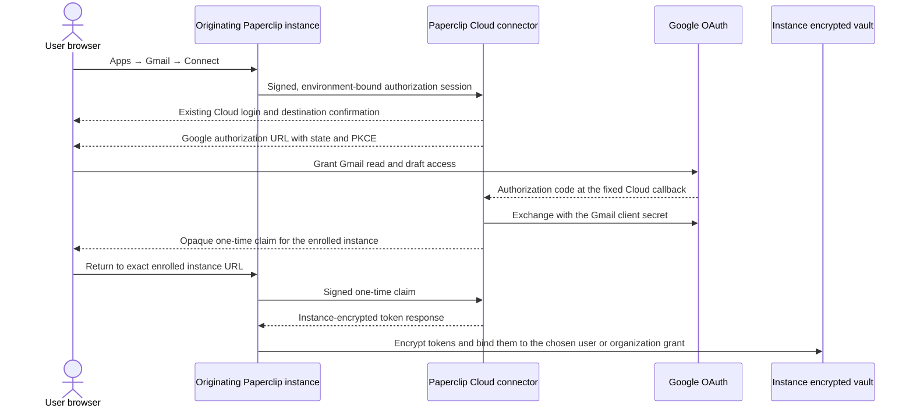

# Gmail connection

Paperclip connects to Google's hosted Gmail MCP server at
`https://gmailmcp.googleapis.com/mcp/v1`. Gmail authorization is separate from
Google sign-in:

- Google sign-in identifies a Paperclip ID user and requests only
  `openid email profile`.
- Gmail authorization lets that user's agents search and read mail and create
  drafts. It requests only `gmail.readonly` and `gmail.compose`.

Do not add Gmail scopes to the Google sign-in client. The existing Paperclip
Cloud application at `my.paperclip.app` hosts the public Gmail OAuth callback;
Paperclip ID remains identity-only. The originating Paperclip instance remains
the durable owner of the encrypted access and refresh tokens.

> Google Workspace MCP is a Developer Preview. Enroll the required Workspace
> organization and test accounts in Google's Developer Preview Program before
> relying on the service.

## Deployment layout

Use a separate Google Cloud project and OAuth web client for each environment:

| Environment | Suggested project id | OAuth client name | Authorized redirect URI |
| --- | --- | --- | --- |
| Development | `paperclip-gmail-dev` | `Paperclip Gmail Connection Dev` | Local Paperclip Cloud origin + `/v1/connector/oauth/google/callback` |
| Staging | `paperclip-gmail-staging` | `Paperclip Gmail Connection Staging` | `https://my-staging.paperclip.app/v1/connector/oauth/google/callback` |
| Production | `paperclip-gmail-prod` | `Paperclip Gmail Connection Production` | `https://my.paperclip.app/v1/connector/oauth/google/callback` |

Replace the development port if the local Paperclip Cloud application uses another
port. Do not register Tailscale, customer, or other self-hosted Paperclip
instance URLs with Google. The browser always returns to Paperclip Cloud first;
Cloud then sends an opaque, one-time claim identifier to the exact
originating instance URL that was enrolled before the flow began.

Keeping projects separate is a Paperclip release policy. It prevents a
development credential or consent-screen change from affecting production and
keeps restricted-scope Gmail verification independent of Google sign-in.

## Google Cloud setup

Repeat this procedure in development, staging, and production. Complete and
test development first, then staging. Do not enable production authorization
until Google verification and Paperclip Security review are complete.

### 1. Create the project

1. Open [Google Cloud project creation](https://console.cloud.google.com/projectcreate).
2. Select the Paperclip Cloud organization and billing account.
3. Create the environment-specific project from the table above.
4. Limit Owner and Editor access to the smallest operator group.
5. Add a monitored engineering or security contact.
6. Record the project id in the private environment runbook. Do not put a
   client secret in the runbook or repository.

### 2. Enable Gmail and Gmail MCP

In **APIs & Services → Library**, enable:

- Gmail API: `gmail.googleapis.com`
- Gmail MCP API: `gmailmcp.googleapis.com`

The equivalent command is:

```sh
gcloud services enable \
  gmail.googleapis.com \
  gmailmcp.googleapis.com \
  --project=PROJECT_ID
```

Do not enable Drive, Docs, Sheets, Calendar, Chat, or People for the Gmail-only
release.

### 3. Configure branding

Open **Google Auth Platform → Branding**. Set:

- App name: `Paperclip`
- User support email: a monitored support address
- Logo: the approved Paperclip logo
- Homepage: the public Paperclip product page
- Privacy policy: the public policy that describes Gmail data handling
- Terms of service: the public Paperclip terms
- Authorized domain: `paperclip.app`
- Developer contact: a monitored security or engineering group

The homepage, privacy policy, and terms must be live on the verified domain
before production verification. The privacy policy must explain that the
originating Paperclip instance stores Gmail credentials and that Paperclip Cloud
performs bounded OAuth exchange, refresh, and provider-supported revocation
without durable plaintext token storage.

### 4. Configure the audience

Open **Google Auth Platform → Audience**.

- Development: select **External**, keep the app in **Testing**, and add only
  developer test accounts.
- Staging: select **External**, keep the app in **Testing**, and add only QA,
  security-review, and verification accounts.
- Production: select **External** and move to **In production** only after the
  required restricted-scope verification and security work is complete.

Google limits an external testing app to 100 test users. For non-basic scopes,
testing grants and their offline refresh tokens can expire after seven days.
Treat that expiry as expected test behavior.

### 5. Add the exact scopes

Open **Google Auth Platform → Data Access → Add or remove scopes → Manually add
scopes** and add only:

```text
https://www.googleapis.com/auth/gmail.readonly
https://www.googleapis.com/auth/gmail.compose
```

Do not add `mail.google.com`, `gmail.modify`, `gmail.send`, Drive, Calendar, or
profile/sign-in scopes. Gmail read and compose are restricted scopes. Public
production use therefore requires Google's restricted-scope verification and
may require an independent security assessment for server-side handling.

### 6. Create the OAuth client

Open **Google Auth Platform → Clients → Create Client**:

1. Select **Web application**.
2. Enter the environment-specific client name from the table above.
3. Add exactly the matching authorized redirect URI.
4. Leave **Authorized JavaScript origins** empty. This is a server-side flow.
5. Create the client.
6. Copy the client id and newly displayed secret directly into the matching
   deployment secret manager.

Never paste either credential into an issue, document, chat, screenshot,
committed `.env`, build log, or browser-visible configuration. Step 7 lists the
deployment variables that receive them.

### 7. Configure the Paperclip Cloud broker deployment

Set these on the existing Paperclip Cloud application that owns the redirect URI above. This is
the broker half of the configuration; the originating Paperclip instance is
configured separately under [Configure each originating Paperclip
instance](#configure-each-originating-paperclip-instance).

| Variable | Development | Staging | Production |
| --- | --- | --- | --- |
| `CLOUD_HARNESS_CONNECTOR_GOOGLE_GMAIL_CLIENT_ID` | Dev client id | Staging client id | Production client id |
| `CLOUD_HARNESS_CONNECTOR_GOOGLE_GMAIL_CLIENT_SECRET_REF` | Dev secret-manager ref | Staging secret-manager ref | Production secret-manager ref |
| Fixed callback | Local Cloud origin + `/v1/connector/oauth/google/callback` | `https://my-staging.paperclip.app/v1/connector/oauth/google/callback` | `https://my.paperclip.app/v1/connector/oauth/google/callback` |
| `CLOUD_HARNESS_CONNECTOR_GOOGLE_ENABLED_PROFILES` | `gmail.read` during the first test | Add reviewed staging profiles | Add only approved production profiles |
| `CLOUD_HARNESS_CONNECTOR_ENVIRONMENT` | `development` | `staging` | `production` |

The client id and secret reference must both be present before a profile can be
used. The callback is derived from Paperclip Cloud's configured customer origin
and the provider's fixed in-code path; it is not accepted from a request or an
environment override. `CLOUD_HARNESS_CONNECTOR_GOOGLE_ENABLED_PROFILES` is the
profile kill switch. An omitted profile is advertised as disabled and every
authorization, refresh, and revocation request for it fails closed.

Set `CLOUD_HARNESS_CONNECTOR_ENVIRONMENT` explicitly in every environment. Every signed
connector request declares its own environment, and the broker accepts the
request only when that value matches both this deployment's environment and the
environment recorded on the enrolled instance. That three-way match is what
makes a leaked staging instance key inert against production, so it must equal
the instance's `PAPERCLIP_CLOUD_CONNECTOR_ENVIRONMENT`.

Paperclip Cloud derives a safe development, staging, or production fallback
from its own customer origin, but the explicit value makes environment
isolation reviewable and avoids a custom hostname being treated as development.
The value is never derived from `NODE_ENV`.

## Connector request requirements

The Gmail authorization request must use:

- the Gmail connector client, not the Google sign-in client;
- `/v1/connector/oauth/google/callback` on Paperclip Cloud;
- `response_type=code`;
- the two exact Gmail scopes above;
- `access_type=offline`;
- `prompt=consent` for every connect and explicit reconnect;
- a random, short-lived, single-use state value; and
- PKCE S256.

Do not send `include_granted_scopes`. After token exchange, compare the granted
scope set with the two required scopes. If either is missing, leave that
personal connection grant inactive and let the user retry deliberately.

No access token, refresh token, Google authorization code, client secret, or
token fragment may appear in a browser URL. The browser return from Paperclip
Cloud to the originating instance contains only an opaque one-time claim id and
the instance's local state.

## Token custody and instance enrollment

The expected flow is:



Before an instance can create a session:

1. The instance generates an Ed25519 signing key and a separate X25519 seal
   key. Both private keys stay local; Ed25519 authenticates requests and
   X25519 lets Paperclip Cloud encrypt token responses that only the instance can
   open.
2. An instance administrator signs in to Paperclip Cloud through its existing
   Paperclip ID OIDC login and enrolls the instance. Enrollment is
   instance-global: ordinary company membership cannot start it, and the
   initiating administrator must complete the return callback.
3. Paperclip Cloud binds the account, opaque instance id, both public keys,
   deployment environment, and exact allowed browser return origins.
4. On authenticated private instances, the setup request supplies its verified
   same-origin HTTPS address and enrollment binds it automatically. This makes a
   Tailscale HTTPS setup config-free while still rejecting a bare or mismatched
   `Host` header. Loopback HTTP is development-only; other plaintext origins are
   rejected.
5. Create, claim, refresh, and supported revoke requests are signed, audience-bound,
   timestamped, and protected by a one-time `jti` replay cache.

Paperclip Cloud may retain instance-encrypted initial-token ciphertext for at most
five minutes. It binds the first claim to a stable local redemption id and only
returns the same ciphertext to that redemption id during the retry window. It
deletes the ciphertext on expiry and excludes it from long-term backups. Refresh
and supported revoke operations handle plaintext only in memory for one bounded
request.

Removing one managed Google profile revokes only the local Paperclip grant.
Paperclip does not call Google's token revocation endpoint for that action.
Google treats revocation as client-wide for the user, so a provider-side revoke
could also invalidate the user's other managed Gmail, Drive, and Calendar
profiles. A future provider-level disconnect must present that all-profiles
effect explicitly.

### Configure each originating Paperclip instance

Generate the two long-lived instance keys once. PEM-encoded PKCS#8 keys work
directly with Paperclip:

```sh
openssl genpkey -algorithm ED25519 -out paperclip-cloud-signing.pem
openssl genpkey -algorithm X25519 -out paperclip-cloud-sealing.pem
openssl pkey -in paperclip-cloud-signing.pem -pubout -out paperclip-cloud-signing.pub.pem
openssl pkey -in paperclip-cloud-sealing.pem -pubout -out paperclip-cloud-sealing.pub.pem
```

Keep both private files in the instance secret manager. Enroll only the public
files with Paperclip Cloud, together with the instance id, the matching environment,
and every exact browser return origin. Then configure the originating Paperclip
deployment:

| Variable | Development | Staging | Production |
| --- | --- | --- | --- |
| `PAPERCLIP_CLOUD_CONNECTOR_BASE_URL` | Local Paperclip Cloud URL | `https://my-staging.paperclip.app` | `https://my.paperclip.app` |
| `PAPERCLIP_CLOUD_CONNECTOR_ENVIRONMENT` | `development` | `staging` | `production` |
| `PAPERCLIP_CLOUD_CONNECTOR_INSTANCE_ID` | Enrolled development instance id | Enrolled staging instance id | Enrolled production instance id |
| `PAPERCLIP_CLOUD_CONNECTOR_SIGN_PRIVATE_KEY` | Development Ed25519 private key | Staging Ed25519 private key | Production Ed25519 private key |
| `PAPERCLIP_CLOUD_CONNECTOR_SEAL_PRIVATE_KEY` | Development X25519 private key | Staging X25519 private key | Production X25519 private key |

Use separate keypairs and instance enrollments across environments. The
connector is unavailable unless all four identity/key variables are present.
HTTP is accepted only for a loopback Paperclip Cloud URL; staging and production
must use HTTPS.

Cloud-hosted stacks receive these values automatically through the existing
per-stack secret-reference delivery path. Self-hosted instances normally use
the Apps enrollment action instead of running the OpenSSL commands manually;
it generates the keys and writes them to the ignored instance secret directory
with owner-only permissions.

`PAPERCLIP_ID_CONNECTOR_*` values are not aliases for this protocol. Paperclip
ID used different endpoints, signing metadata, envelope purposes, and Google
client credentials. An instance with only those legacy values fails with
`CONNECTOR_MIGRATION_REQUIRED`. Enroll it with Paperclip Cloud and reconnect
each legacy Google grant. Cloud-hosted fleets must deliver the new enrollment
keys before they deploy a binary that enables the Cloud connector.

## Paperclip access defaults

Gmail uses the same credential ownership choice as the rest of the Apps setup:

- **Just me** stores the Gmail credential on the connecting user's grant.
- **Any human in the organization** stores it on the default organization grant
  so a deliberately shared mailbox or Workspace account can back
  organization-wide use.
- The disclosure states that Gmail access can search/read mail and create
  drafts. Sending mail is not enabled.
- A user grant does not automatically authorize an agent. The user must also
  install the connection for that agent, select an access profile, and grant
  standing delegation before autonomous use.
- Read, search, get, and list tools may be enabled after explicit profile
  review.
- Draft creation and label changes require **Ask first**.
- Trash, spam, destructive label changes, newly discovered tools, nested
  execution, and any future send tool remain blocked until separately reviewed.

## Verification checklist

### Development

1. Enable the connector only in development.
2. Confirm the broker's `CLOUD_HARNESS_CONNECTOR_ENVIRONMENT` and the instance's
   `PAPERCLIP_CLOUD_CONNECTOR_ENVIRONMENT` both read `development`. A mismatch
   fails every signed request with an environment error before Google is ever
   contacted, which looks nothing like a Google misconfiguration.
3. Use an isolated Gmail test mailbox.
4. Connect from localhost and one explicitly enrolled Tailscale HTTPS origin.
5. From the board Test panel, run `list_labels` and a bounded
   `search_threads` query.
6. Install the reviewed profile on one test agent and repeat one read-only call
   in a fresh agent run.
7. Create a draft through an Ask-first approval and verify no send action is
   exposed.
8. Force access-token expiry and verify refresh changes only the originating
   instance's encrypted secret version.
9. Revoke the grant and verify the next call fails closed.
10. Confirm sanitized logs, activity, API payloads, agent context, and browser
    history contain no credential or authorization code.

### Staging

Repeat development verification, then add negative tests for replayed state,
wrong origin, wrong instance, wrong company, wrong user, wrong environment,
expired claim, missing scope, inactive membership, connector outage, and the
seven-day testing-token expiry.

### Production

1. Complete Developer Preview enrollment, restricted-scope verification, any
   required security assessment, and Paperclip Security review.
2. Configure only the production project credentials in production secrets.
3. Start with an internal allowlist and read tools.
4. Enable Ask-first draft and label tools only after production telemetry is
   clean.
5. Keep destructive and send-email capabilities blocked.
6. Keep the environment-specific connector kill switch available. When it is
   off, new authorization and refresh fail with an actionable error and never
   fall back to Google sign-in or another user's grant.

## Troubleshooting

| Symptom | Check |
| --- | --- |
| `redirect_uri_mismatch` | The client contains the exact environment callback, including scheme, host, port, path, and no extra slash. |
| Test user cannot consent | The account is listed under the environment project's Audience test users and is enrolled in Workspace Developer Preview. |
| Refresh fails after seven days | The external app is still in Testing. Reauthorize the test user; do not treat this as token-rotation failure. |
| One required capability is missing | Inspect the returned granted scope set. Keep the grant inactive if either exact required scope is absent. |
| Local or Tailscale return is rejected | Enroll the exact origin on Paperclip Cloud. Only loopback HTTP is allowed; Tailscale must use HTTPS. |
| Every signed request fails on environment | `CLOUD_HARNESS_CONNECTOR_ENVIRONMENT`, the enrollment record, and `PAPERCLIP_CLOUD_CONNECTOR_ENVIRONMENT` must agree. |
| The managed method is unavailable | Confirm the exact profile is in `CLOUD_HARNESS_CONNECTOR_GOOGLE_ENABLED_PROFILES` and its client id and secret reference are configured. |
| Login starts asking for Gmail | Stop the rollout. The login and Gmail clients or route namespaces have been mixed. |
| Connector is unavailable | Keep the grant in `needs_reauthorization` or an actionable unavailable state. Never use a login token or another environment's client. |

## References

- [Configure Google Workspace MCP servers](https://developers.google.com/workspace/guides/configure-mcp-servers)
- [OAuth 2.0 for web server applications](https://developers.google.com/identity/protocols/oauth2/web-server)
- [Google OAuth 2.0 policies](https://developers.google.com/identity/protocols/oauth2/policies)
- [Choose Gmail API scopes](https://developers.google.com/workspace/gmail/api/auth/scopes)
- [Google Workspace API user data and developer policy](https://developers.google.com/workspace/workspace-api-user-data-developer-policy)
