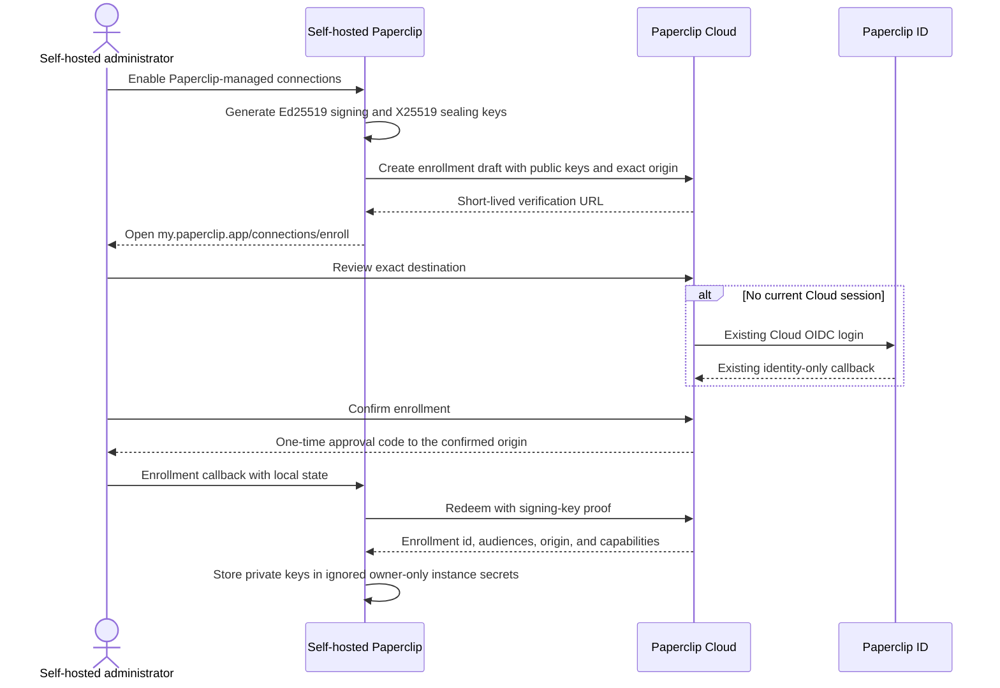
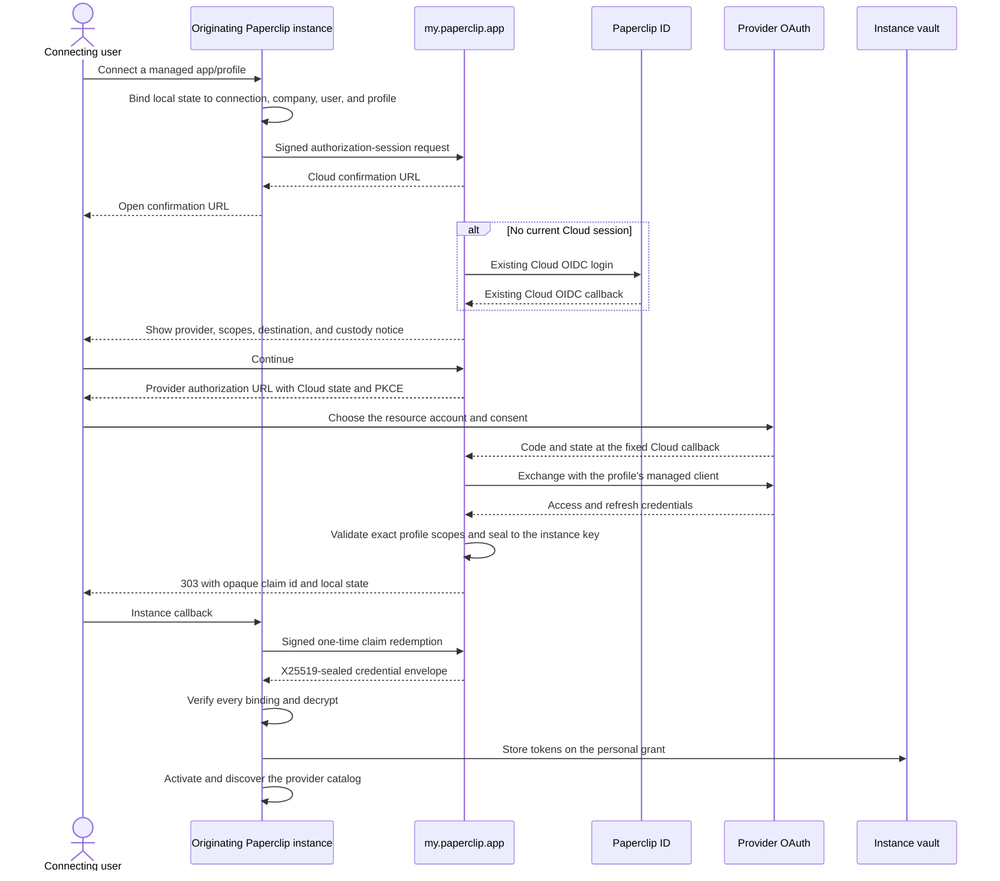
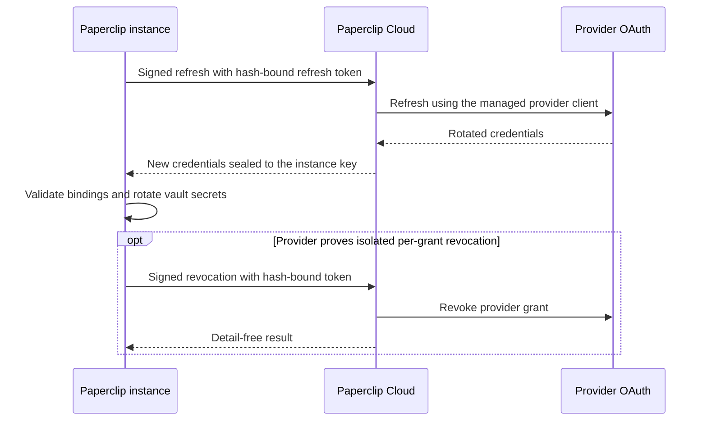

# Self-Serve MCP Connections Program

Date: 2026-08-26

## Outcome

Paperclip treats a connection method as the capability boundary. A curated MCP method may declare automatic OAuth registration (`dcr`, including CIMD), a customer-owned OAuth client (`customer`), an API key, or a provider-generated MCP URL. Provider tokens and client secrets remain in the instance's encrypted vault. Paperclip ID remains the future broker for `platform_shared` registrations; the self-serve catalog does not depend on it.

The machine-readable evidence ledger is [`packages/shared/src/self-serve-mcp-research.json`](../../packages/shared/src/self-serve-mcp-research.json). It is the source for the generated app definitions and records the documentation URL, current endpoint, authentication mode, prerequisite, risk tier, and verification date for all 46 researched providers.

Store visibility is a separate release gate from having an implemented definition. As of 2026-08-27, Browse exposes 29 providers. The following definitions remain available to existing saved connections and the verification program but are withheld from Browse, new source deep links, and agent connection suggestions until they are ready:

- Pending live testing: beehiiv, Bitly, Candid, Kernel, Coda, Local Falcon, Make, Manufact, O'Reilly, PlanetScale, TickTick, Brex, Egnyte, Embat, Razorpay, Sanity, Ticket Tailor, Google Sheets, Context7, and Similarweb.
- Reserved for future first-party connection experiences: GitHub and Slack.

## Platform checklist

- [x] Replace the Notion-only OAuth allowlist with app-definition capability checks.
- [x] Support DCR/CIMD browser sign-in for curated remote MCP methods.
- [x] Accept customer-owned OAuth client IDs and secrets only when a method declares `customer` ownership.
- [x] Store customer OAuth secrets and provider tokens as encrypted secret references, never inline in connection configuration or API responses.
- [x] Keep Paperclip ID limited to explicitly brokered `platform_shared` methods such as Gmail.
- [x] Contain curated OAuth scopes to the method's reviewed `scopesHint`; omit scope when the method has no hint and reject caller widening.
- [x] Reuse the existing connection setup flow for browser sign-in, customer OAuth apps, API keys, tenant fields, and generated URLs.
- [x] Correct the Jira, Cloudinary, Kernel, Resend, ClickHouse, Postman, PagerDuty, Supabase, PlanetScale, and Zapier connection shapes.
- [x] Keep G2, Vercel, and Zomato out of the connectable catalog while retaining their evidence and reconsideration criteria.

## Catalog delivery and branding checklist

- [x] Derive Browse, setup, reconnect, and additional-account routes from method capabilities instead of a slug switch.
- [x] Route automatic OAuth, customer OAuth, API-key, and no-auth methods through `/apps/connect?source=<slug>`; retain Zapier's provider-generated URL path.
- [x] Show the instance-provided `availability.reason` for Gmail and any future instance-disabled store app; remove “Coming soon” from the connectable catalog.
- [x] Retain vetted local provider marks under `ui/public/brands/apps/` for every implemented definition, including providers currently withheld from Browse.
- [x] Record provider, local asset, official source, upstream asset, format, visibility, and dark-variant requirements in `ui/public/brands/apps/manifest.json`.
- [x] Preserve local light/dark branding paths through definition regeneration and validate every SVG/PNG during manifest tests.
- [x] Reuse `AppLogo` across Browse, setup, success, Connections, details, sidebars, and connection-intent cards; retain its deterministic letter tile only for runtime image failure.
- [x] Replace the compact method segment with full-row radio choices that name authentication, mode/region, and when to use each method.
- [x] Present warnings, prerequisites, and provider documentation before credentials or consent.
- [x] Prevent automatic OAuth from bypassing tenant/extension fields or the customer-owned OAuth alternative; ClickHouse must collect `serviceId`.
- [x] Default every discovered action to On, with S4 write and destructive actions governed by ask-first; Supabase remains project-scoped but starts write-capable.
- [x] Add an opt-in credential-free metadata preflight. It performs guarded GET requests only and never creates a connection or invokes OAuth registration.

## Provider rollout checklist

“Definition” means the reviewed manifest and UI/server setup contract are implemented. “Live proof” requires a provider account and must be completed before production enablement: authorize in a browser, list tools, run one safe read, refresh/reconnect, revoke, and inspect API responses and logs for secret leakage.

| Provider | Wave | Definition | Live proof | Notes |
|---|---:|:---:|:---:|---|
| Jira | 1 | [x] | [ ] | Reference DCR/CIMD flow; `https://mcp.atlassian.com/v1/mcp/authv2`. On 2026-08-27, browser authorization, 26-tool discovery, tenant lookup, a safe project read, JQL search, and reconnect passed against `paperclipteam.atlassian.net`; revocation remains pending because the working connection was retained. Atlassian's `/authv2` rollout requires the reviewed protected-resource scope set to be sent explicitly before consent. |
| Airtable | 1 | [x] | [ ] | Enterprise client allowlisting may apply. On 2026-08-27, browser authorization was limited to the single `Untitled Base`, tool discovery succeeded, and `List Airtable bases` returned that base through Paperclip; reconnect/revoke and the final log audit remain pending. |
| beehiiv | 1 | [x] | [ ] | Plan controls write capabilities. |
| Bitly | 1 | [x] | [ ] | Browser sign-in and API-token methods. |
| Candid | 1 | [x] | [ ] | DCR. |
| Cloudflare | 1 | [x] | [ ] | Browser sign-in and API-token methods. |
| Cloudinary | 1 | [x] | [ ] | Current `/mcp` endpoint, not the captured SSE endpoint. On 2026-08-27, browser authorization against cloud `z4nrpggk`, tool discovery, and the safe `get-usage-details` read succeeded; reconnect/revoke and the final log audit remain pending. |
| Coda | 1 | [x] | [ ] | Browser sign-in and personal token; beta warning. |
| Hugging Face | 1 | [x] | [ ] | DCR/CIMD. On 2026-08-27, browser authorization completed with only the reviewed `read-mcp` scope and no organization grant, five tools were discovered, and `Hugging Face User Info` succeeded without returning the token value; reconnect/revoke and the final log audit remain pending. |
| Kernel | 1 | [x] | [ ] | Current `/mcp` endpoint; API-key alternative. |
| Local Falcon | 1 | [x] | [ ] | DCR. |
| Make | 1 | [x] | [ ] | DCR. |
| Manufact | 1 | [x] | [ ] | DCR. |
| Miro | 1 | [x] | [ ] | Enterprise client restrictions may apply. On 2026-08-27, the first live exchange found that Paperclip overrode Miro's advertised DCR client-auth order and selected `client_secret_basic`; preserving the provider's `client_secret_post` preference fixed the exchange. Reauthorization, 60-tool discovery, and `Who Am I` then succeeded; reconnect/revoke and the final log audit remain pending. |
| Netlify | 1 | [x] | [ ] | DCR. On 2026-08-27, the saved draft resumed through Netlify consent, nine tools were discovered, and the safe `get-user` read succeeded. The public connection response exposed only a vault secret reference, not the access token; reconnect/refresh, revoke, and the final log audit remain pending. |
| Notion | 1 | [x] | [ ] | Existing DCR definition hardened by scope containment. |
| O'Reilly | 1 | [x] | [ ] | Browser sign-in and token methods. |
| PlanetScale | 1 | [x] | [ ] | Database and insights-only methods; optional intended project/branch metadata. |
| PostHog | 1 | [x] | [ ] | OAuth and API-key methods support optional advanced project pinning; the recommended OAuth path requires no project ID. |
| Resend | 1 | [x] | [ ] | Current `/mcp` endpoint. |
| Sentry | 1 | [x] | [ ] | Existing DCR/CIMD definition enabled. On 2026-08-27, browser authorization, seven-tool discovery, and the safe `find_organizations` read succeeded against `paperclip-5s`. Sentry intentionally disables its upstream `Approve` control until one second after the first pointer or keyboard interaction; live-test automation must satisfy that guard before treating the provider as blocked. The public connection response exposed only a vault secret reference, not the access token; reconnect/refresh, revoke, and the final log audit remain pending. |
| TickTick | 1 | [x] | [ ] | DCR. |
| Todoist | 1 | [x] | [ ] | DCR. |
| Webflow | 1 | [x] | [ ] | Tenant roles constrain site access. |
| Wix | 1 | [x] | [ ] | DCR. |
| Brex | 2 | [x] | [ ] | Early access/admin prerequisite; S4 warning. |
| ClickHouse | 2 | [x] | [ ] | `/clickstack`; required `x-service-id` header. |
| Egnyte | 2 | [x] | [ ] | Plan and external-LLM admin prerequisites. |
| Embat | 2 | [x] | [ ] | WorkOS DCR/CIMD; pilot because documentation is sparse. |
| Mixpanel | 2 | [x] | [ ] | Beta warning. |
| Postman | 2 | [x] | [ ] | US OAuth and EU API-key methods for minimal/code/full endpoints. |
| Razorpay | 2 | [x] | [ ] | OAuth and key method; S4 financial warning. |
| Sanity | 2 | [x] | [ ] | Browser sign-in and token methods. |
| Stripe | 2 | [x] | [ ] | OAuth and key method; public-preview/S4 warning. |
| Supabase | 2 | [x] | [ ] | Project required, write-capable default, optional feature groups, production-data warning. |
| Ticket Tailor | 2 | [x] | [ ] | Provider-hosted authorization may request an API key. |
| Asana | 3 | [x] | [ ] | Customer-owned OAuth app; DCR intentionally disabled. |
| Box | 3 | [x] | [ ] | Customer-owned OAuth app and Box admin prerequisite. |
| Mem0 | 3 | [x] | [ ] | Bearer API key. |
| PagerDuty | 3 | [x] | [ ] | API token; separate US and EU methods. |
| Similarweb | 3 | [x] | [ ] | `api-key` header and API-enabled subscription. |
| Xero | 3 | [x] | Withheld | Browser OAuth and refresh tokens succeeded on 2026-08-27, but `mcp.xero.com/mcp` rejected the valid third-party access token with HTTP 401. Withheld from Browse pending Xero support for customer-created OAuth clients on the hosted endpoint; this matches the unresolved report in [Xero's MCP repository](https://github.com/xeroapi/xero-mcp-server/issues/212). |
| Zapier | 3 | [x] | [ ] | Existing generated-URL flow; never substitutes a static shared endpoint. |
| G2 | Blocked | [x] | n/a | Reconsider after a customer-created client works without G2 coordination. |
| Vercel | Blocked | [x] | n/a | Reconsider when reviewed-client approval is removed or Paperclip is approved. |
| Zomato | Blocked | [x] | n/a | Reconsider when third-party clients and unallowlisted redirect URIs are supported. |

## Browser authorization redirect audit

This is a local, credential-free handoff check performed through the real BOB catalog UI on 2026-08-26. A checked provider reached its own login, consent, domain-picker, or authorization page. It does **not** satisfy the account-bound live-proof column above, which still requires consent, tool discovery, a safe read, reconnect/refresh, revocation, and secret-leak inspection.

- [x] Jira, Airtable, beehiiv, Bitly, Candid, Cloudflare, Cloudinary, Coda, Hugging Face, Kernel, Local Falcon, Make, Manufact, Miro, Netlify, Notion, O'Reilly, PlanetScale, PostHog, Resend, Sentry, TickTick, Todoist, Webflow, and Wix.
- [x] ClickHouse, Egnyte, Embat, Mixpanel, Postman, Razorpay, Sanity, Stripe, Supabase, and Ticket Tailor.
- [ ] Brex — the documented `https://api.brex.com/mcp` endpoint did not return discovery or challenge data from this development environment before the guarded network timeout. Brex also requires Developer API access plus its admin/early-access setup. Re-run after those account prerequisites are enabled; do not treat the current timeout as an OAuth compatibility result.
- [ ] Gmail — intentionally unavailable on this instance because its Paperclip ID connector is not configured; Browse shows the instance-provided configuration notice instead of starting OAuth.

The audit found and fixed shared interoperability faults rather than adding provider exceptions: bounded provider-added DCR grants, RFC 7591 zero secret-expiry sentinels for public clients, authorization servers that explicitly omit refresh-token support, guarded HTTP requests that require a stable User-Agent, and numeric-loopback callbacks rejected by DCR servers. Hugging Face now explicitly requests only `read-mcp` instead of allowing the provider's omitted-scope default to request its complete scope set.

## Tailscale HTTPS OAuth compatibility audit — 2026-08-31

This audit used the isolated `apps-https-qa` full-clone instance on port 3102 at commit `5a988df600ebda30e446496862bf83c76d6d53d6`. The default instance remained on port 3100. Tailscale Serve mapped only `https:443` at `https://dottas-macbook-pro.tail29c1aa.ts.net` to `http://127.0.0.1:3102`; Funnel was not enabled. `PAPERCLIP_PUBLIC_URL` used that HTTPS origin, and no generic or provider-specific `PAPERCLIP_TOOL_OAUTH_*CLIENT*` override was present.

The dedicated `Apps HTTPS QA 2026-08-31` company had zero agents. Loopback and HTTPS health, bootstrap readiness, cloned source data, and browser access passed. The OAuth client-metadata document exposed exactly one redirect URI: `https://dottas-macbook-pro.tail29c1aa.ts.net/api/tools/oauth/callback`. Successful grants and unsuccessful drafts were retained; no provider grant was revoked and neither Paperclip server was stopped.

The credential-free preflight reached every one of the 19 automatic-OAuth endpoints, found OAuth metadata for all 19, and found DCR advertised for all 19. CIMD was also advertised by Notion, PostHog, Sentry, Jira, Airtable, Cloudflare, Hugging Face, Resend, and Todoist; the other ten did not advertise CIMD. The Tailscale hostname is tailnet-private and is not a public CIMD client ID. No app in this run was CIMD-only, so none received `public_cimd_retest_needed`.

The matrix has exactly 35 terminal rows: 19 automatic OAuth, 12 customer OAuth, and four non-OAuth. “Exact callback” below means `https://dottas-macbook-pro.tail29c1aa.ts.net/api/tools/oauth/callback`. No provider tool was invoked and no read or write action was run.

| # | App | Method / declared ownership | Credential-free preflight | Callback / registration source | Browser, callback/token, and catalog outcome | Prerequisite / Paperclip error code | Conclusion |
|---:|---|---|---|---|---|---|---|
| 1 | Notion | Recommended hosted OAuth / `dcr` | Reachable; OAuth metadata yes; DCR yes; CIMD yes | Exact callback / `dcr` | Provider returned through the callback; state and token exchange passed; active/healthy; 37 actions discovered | Sole workspace selected; error code none | `works_out_of_box_dcr` |
| 2 | PostHog | Recommended hosted OAuth / `dcr` | Reachable; OAuth metadata yes; DCR yes; CIMD yes | Exact callback / `dcr` | Provider returned through the callback; state and token exchange passed; active/healthy; 684 actions discovered | Default project access; error code none | `works_out_of_box_dcr` |
| 3 | Sentry | Recommended hosted OAuth / `dcr` | Reachable; OAuth metadata yes; DCR yes; CIMD yes | Exact callback / `dcr` | Provider returned through the callback; state and token exchange passed; active/healthy; nine actions discovered | Existing account consent; error code none | `works_out_of_box_dcr` |
| 4 | Jira | Recommended hosted OAuth / `dcr` | Reachable; OAuth metadata yes; DCR yes; CIMD yes | Exact callback / `dcr` | DCR and provider consent loaded, but tenant policy rejected the callback domain before consent; no token or catalog | Tenant callback-domain policy; error code none | `callback_or_client_allowlist_rejected` |
| 5 | Airtable | Recommended hosted OAuth / `dcr` | Reachable; OAuth metadata yes; DCR yes; CIMD yes | Exact callback / `dcr` | Provider returned through the callback; state and token exchange passed; active/healthy; 43 actions discovered | Sole visibly non-production base selected; error code none | `works_out_of_box_dcr` |
| 6 | Cloudflare | Recommended hosted OAuth / `dcr` | Reachable; OAuth metadata yes; DCR yes; CIMD yes | Exact callback / `dcr` draft | Provider accepted the callback and reached account selection; no account was selected, so no token or catalog | Two plausible accounts; error code none | `resource_selection_needed` |
| 7 | Cloudinary | Recommended hosted OAuth / `dcr` | Reachable; OAuth metadata yes; DCR yes; CIMD no | Exact callback / `dcr` | Provider returned through the callback; state and token exchange passed; active/healthy; 30 actions discovered | Sole cloud selected; error code none | `works_out_of_box_dcr` |
| 8 | Hugging Face | Recommended hosted OAuth / `dcr` | Reachable; OAuth metadata yes; DCR yes; CIMD yes | Exact callback / `dcr` | Provider returned through the callback; state and token exchange passed; active/healthy; five actions discovered | Organization access omitted; error code none | `works_out_of_box_dcr` |
| 9 | Miro | Recommended hosted OAuth / `dcr` | Reachable; OAuth metadata yes; DCR yes; CIMD no | Exact callback / `dcr` | Provider install relay returned through the callback; state and token exchange passed; active/healthy; 57 actions discovered | Sole preselected organization/team; error code none | `works_out_of_box_dcr` |
| 10 | Netlify | Recommended hosted OAuth / `dcr` | Reachable; OAuth metadata yes; DCR yes; CIMD no | Exact callback / `dcr` | Provider relay returned through the callback; state and token exchange passed; active/healthy; nine actions discovered | Existing account consent; error code none | `works_out_of_box_dcr` |
| 11 | Resend | Recommended hosted OAuth / `dcr` | Reachable; OAuth metadata yes; DCR yes; CIMD yes | Exact callback / `dcr` | Provider returned through the callback; state and token exchange passed; active/healthy; 99 actions discovered | Sole team and sending-only access selected; error code none | `works_out_of_box_dcr` |
| 12 | Todoist | Recommended hosted OAuth / `dcr` | Reachable; OAuth metadata yes; DCR yes; CIMD yes | Exact callback / `dcr` | Provider returned through the callback; state and token exchange passed; active/healthy; 47 actions discovered | Existing account consent; error code none | `works_out_of_box_dcr` |
| 13 | Webflow | Recommended hosted OAuth / `dcr` | Reachable; OAuth metadata yes; DCR yes; CIMD no | Exact callback / `dcr` draft | Callback trust step passed; a provider sign-in route returned HTTP 502 before authorization; no token or catalog | Provider sign-in path; error code none | `provider_error_or_timeout` |
| 14 | Wix | Recommended hosted OAuth / `dcr` | Reachable; OAuth metadata yes; DCR yes; CIMD no | Exact callback / `dcr` draft | Provider sign-in loaded with the exact callback but did not advance through the available account sign-in; no token or catalog | Provider sign-in/anti-automation gate; error code none | `sign_in_mfa_or_captcha_blocked` |
| 15 | ClickHouse | Recommended hosted OAuth / `dcr` | Reachable; OAuth metadata yes; DCR yes; CIMD no | Exact callback / no registration attempted | Paperclip required a ClickHouse Cloud service ID before OAuth; no callback, token, or catalog | Service selection required; error code none | `resource_selection_needed` |
| 16 | Mixpanel | Recommended hosted OAuth / `dcr` | Reachable; OAuth metadata yes; DCR yes; CIMD no | Exact callback / `dcr` | Provider returned through the callback; state and token exchange passed; active/healthy; 64 actions discovered | Existing account consent; error code none | `works_out_of_box_dcr` |
| 17 | Postman | US minimal hosted OAuth / `dcr` | Reachable; OAuth metadata yes; DCR yes; CIMD no | Exact callback / `dcr` | Provider relay returned through the callback; state and token exchange passed; active/healthy; 41 actions discovered | Minimal catalog selected; error code none | `works_out_of_box_dcr` |
| 18 | Stripe | Recommended hosted OAuth / `dcr` | Reachable; OAuth metadata yes; DCR yes; CIMD no | Exact callback / `dcr` | Provider returned through the callback; state and token exchange passed; active/healthy; ten actions discovered | Visibly labeled test environment and read-only access selected; error code none | `works_out_of_box_dcr` |
| 19 | Supabase | Recommended hosted OAuth / `dcr` | Reachable; OAuth metadata yes; DCR yes; CIMD no | Exact callback / no registration attempted | Paperclip required a project reference before OAuth; no callback, token, or catalog | Development project selection required; error code none | `resource_selection_needed` |
| 20 | Linear | Customer-created OAuth app / `customer` | Not applicable; UI contract inspected | Exact callback / customer client | UI requires preregistering the callback and a client ID; client secret is optional for a public client; OAuth not started | Customer-created Linear app; error code none | `preregistration_required_by_design` |
| 21 | Asana | Customer-created OAuth app / `customer` | Not applicable; UI contract inspected | Exact callback / customer client | UI states DCR is unsupported and requires preregistering the callback and a client ID; client secret is optional for a public client; OAuth not started | Customer-created Asana MCP app; error code none | `preregistration_required_by_design` |
| 22 | Box | Customer-created OAuth app / `customer` | Not applicable; UI contract inspected | Exact callback / customer client | UI requires preregistering the callback and a client ID; client secret is optional for a public client; OAuth not started | Box administrator, AI access, and customer-created app; error code none | `preregistration_required_by_design` |
| 23 | Gmail | Google OAuth app / `customer` | Not applicable; UI contract inspected | Exact callback / customer client | UI requires preregistering the callback and customer client ID; client secret is optional for a public client; OAuth not started | Developer Preview enrollment, Cloud project/API enablement; error code none | `preregistration_required_by_design` |
| 24 | Google Drive | Google OAuth app / `customer` | Not applicable; UI contract inspected | Exact callback / customer client | UI requires preregistering the callback and customer client ID; client secret is optional for a public client; OAuth not started | Developer Preview enrollment, Cloud project/API enablement; error code none | `preregistration_required_by_design` |
| 25 | Google Docs | Google OAuth app / `customer` | Not applicable; UI contract inspected | Exact callback / customer client | UI requires preregistering the callback and customer client ID; client secret is optional for a public client; OAuth not started | Developer Preview enrollment, Cloud project/API enablement; error code none | `preregistration_required_by_design` |
| 26 | Google Sheets | Google OAuth app / `customer` | Not applicable; UI contract inspected | Exact callback / customer client | UI requires preregistering the callback and customer client ID; client secret is optional for a public client; OAuth not started | Developer Preview enrollment, Cloud project/API enablement; error code none | `preregistration_required_by_design` |
| 27 | Google Slides | Google OAuth app / `customer` | Not applicable; UI contract inspected | Exact callback / customer client | UI requires preregistering the callback and customer client ID; client secret is optional for a public client; OAuth not started | Developer Preview enrollment, Cloud project/API enablement; error code none | `preregistration_required_by_design` |
| 28 | Google Calendar | Google OAuth app / `customer` | Not applicable; UI contract inspected | Exact callback / customer client | UI requires preregistering the callback and customer client ID; client secret is optional for a public client; OAuth not started | Developer Preview enrollment, Cloud project/API enablement; error code none | `preregistration_required_by_design` |
| 29 | Google Chat | Google OAuth app / `customer` | Not applicable; UI contract inspected | Exact callback / customer client | UI requires preregistering the callback and customer client ID; client secret is optional for a public client; OAuth not started | Developer Preview enrollment, Cloud project/API enablement; error code none | `preregistration_required_by_design` |
| 30 | Google People | Google OAuth app / `customer` | Not applicable; UI contract inspected | Exact callback / customer client | UI requires preregistering the callback and customer client ID; client secret is optional for a public client; OAuth not started | Developer Preview enrollment, Cloud project/API enablement; error code none | `preregistration_required_by_design` |
| 31 | Google Workspace Search | Google OAuth app / `customer` | Not applicable; UI contract inspected | Exact callback / customer client | UI requires preregistering the callback and customer client ID; client secret is optional for a public client; OAuth not started | Developer Preview enrollment, Cloud project/API enablement; error code none | `preregistration_required_by_design` |
| 32 | Zapier | Provider-generated MCP URL / non-OAuth | Not applicable | Not applicable | UI requires the complete provider-generated MCP URL, including its embedded token | Provider-generated URL; error code none | `not_applicable_non_oauth` |
| 33 | Shopify | Public Storefront MCP / no auth | Not applicable | Not applicable | UI identifies a public no-auth endpoint and requires a launched public storefront | Public storefront and permanent store domain; error code none | `not_applicable_non_oauth` |
| 34 | Mem0 | Bearer API key / non-OAuth | Not applicable | Not applicable | UI requires a customer-created API key | Customer API key; error code none | `not_applicable_non_oauth` |
| 35 | PagerDuty | API token / non-OAuth | Not applicable | Not applicable | UI requires a customer-created API token and regional endpoint | Customer token and account region; error code none | `not_applicable_non_oauth` |

Summary counts:

- `works_out_of_box_dcr`: 13 — Notion, PostHog, Sentry, Airtable, Cloudinary, Hugging Face, Miro, Netlify, Resend, Todoist, Mixpanel, Postman minimal, and Stripe.
- `preregistration_required_by_design`: 12 — Linear, Asana, Box, and the nine Google Workspace cards.
- `callback_or_client_allowlist_rejected`: 1 — Jira. This is the only newly observed stable-callback/allowlist candidate.
- `resource_selection_needed`: 3 — Cloudflare, ClickHouse, and Supabase.
- `provider_error_or_timeout`: 1 — Webflow.
- `sign_in_mfa_or_captcha_blocked`: 1 — Wix.
- `not_applicable_non_oauth`: 4 — Zapier, Shopify, Mem0, and PagerDuty.
- `manual_client_required`, `oauth_passed_catalog_failed`, `account_or_plan_prerequisite`, and `public_cimd_retest_needed`: 0 each.

The evidence supports arbitrary HTTPS callbacks through DCR for the 13 passing apps. Jira is the only automatic-OAuth app in this run that produced direct callback-domain allowlist evidence. The five inconclusive automatic-OAuth results are resource- or sign-in/provider-path blockers, not evidence that they require a shared stable callback. The 12 customer-client apps already require preregistration by design and are not newly discovered stable-callback candidates.

## Paperclip Cloud managed OAuth broker — 2026-08-31

The managed-callback P2 is part of the existing Paperclip Cloud application at
`my.paperclip.app`. It does not add a service, hostname, repository, login
system, or provider route to Paperclip ID. Paperclip ID authenticates the user
for the existing Cloud customer session. Cloud owns fixed provider callbacks,
provider client credentials, enrollment, explicit destination confirmation,
code exchange, refresh, and revocation. The originating Paperclip instance is
the only durable provider-token vault and continues to execute provider tools
directly.

The production Google callback is fixed at
`https://my.paperclip.app/v1/connector/oauth/google/callback`; the reserved Box
path remains dark until Paperclip owns a distributable, provider-approved Box
application. Provider endpoints, clients, profiles, exact scope sets, resource
servers, eligibility, approval state, and kill switches come from a closed
Cloud registry. A caller cannot supply any of them.

### Self-hosted enrollment

Cloud-hosted stacks are enrolled automatically during provisioning. Existing
stacks receive a lazy backfill on their next managed deployment or first
managed-connection roll. The existing per-stack secret store mints and retains
the private keypairs, the existing provider delivery path places their values
in the tenant environment, and the Cloud connector registry stores only public
keys and the exact active stack origin.

Every self-hosted enrollment requires HTTPS except exact HTTP loopback. The
Cloud confirmation page prominently displays the normalized destination.
Unknown, replayed, and expired enrollment state terminates on Cloud without an
instance redirect. Tailscale HTTPS works because the browser performs the
return trip; Cloud does not need to reach the private hostname.

### Provider connection and custody

Only the opaque claim id and the instance's local state cross the browser back
to the instance. Provider codes, tokens, error descriptions, client secrets,
emails, and tenant identifiers do not appear in URLs. Cloud consumes provider
state before examining any code or provider error; unknown and replayed state
never redirects. Initial ciphertext expires within five minutes. The first
claim binds it to a stable local redemption id, and only that id can retry the
same sealed envelope before expiry. Plaintext provider tokens exist in Cloud
memory only for the bounded exchange, refresh, or supported revocation request.

Managed grants therefore depend on Cloud for refresh and supported provider
revocation, but not for provider tool calls. Managed Google profile removal is
local-only because Google client-wide revocation can invalidate the same user's
other Workspace profiles. A temporary Cloud outage leaves an existing access
token usable until it expires and then surfaces as a temporary refresh failure.
Customer-created clients remain available for self-hosters who need full
independence or for providers not approved for a managed multi-tenant client.

### Security and rollout boundary

Every instance operation requires an enrolled Ed25519 signature, exact
audience/environment/provider/profile/scope binding, a short expiry, and a
single-use request id. Credential envelopes bind their purpose plus the same
instance, environment, provider, profile, and sorted scope set as AEAD
additional data. Exact origin matching has no wildcard, prefix, or suffix
mode. Cloud login and explicit destination confirmation are required for every
new authorization. Per-IP, account, instance, and provider limits, instance
suspension, profile kill switches, and self-host eligibility checks provide
additional containment; no generic OAuth endpoint or provider API proxy exists.

All real profiles are dark-launched. Google begins with an internal
`gmail.read` pilot only after Developer Preview enrollment, OAuth verification,
and any restricted-scope assessment. Jira remains the next callback-allowlist
research target. The 13 proven DCR providers stay instance-local, and Box stays
customer-client-only until publication, commercial, enterprise-admin, and
self-host distribution terms are approved.

## Automated acceptance

- [x] Manifest tests assert 46 researched entries, 43 self-serve candidates, three blocked providers, unique slugs, HTTPS documentation/endpoints, authentication mode, prerequisite, risk tier, and verification date.
- [x] Definition tests cover corrected endpoints, ClickHouse's service header, Postman's six modes, Supabase's write-capable default, and customer-owned OAuth ownership.
- [x] Server tests cover DCR reuse, CIMD/DCR fixtures, customer OAuth secret storage, scope containment, token refresh/revocation, SSRF rejection, company isolation, and failed-setup cleanup.
- [x] UI tests cover automatic OAuth, customer-owned OAuth credentials, API keys, generated URLs, tenant fields, prerequisites, and unavailable-provider policy.
- [x] Branding tests require exactly 29 store-visible, unique, local, decodable marks and preserve provenance for withheld definitions.
- [x] Routing tests prove all 29 store-visible providers are actionable, all 22 release-gated providers remain absent, and all three blocked providers remain absent.
- [x] Metadata preflight tests prove Jira discovery sends no credential, makes no registration request, and treats an authentication challenge as endpoint reachability.
- [x] Browser handoff checks reach provider authorization for 35 of 37 automatic-OAuth catalog entries; Brex and instance-disabled Gmail remain explicitly tracked above.
- [x] `pnpm check:token-gates` is required for the UI change.
- [ ] Complete the account-bound live proof column above before declaring each provider production-verified.

## Remaining external verification

The code paths and catalog definitions are complete. The unchecked work is deliberately account-bound and cannot be inferred from public metadata alone:

1. Start with Jira, then complete Wave 1 automatic OAuth providers. For each provider: authorize, list tools, run one safe read, reconnect/refresh, revoke, and inspect API responses and server logs for secrets.
2. Validate customer-created OAuth applications end to end for Asana, Box, and Xero, including redirect URI configuration and tenant-admin prerequisites.
3. Validate restricted-key flows for Mem0, PagerDuty, Similarweb, and every API-key alternative; confirm the manifest's exact header/query placement.
4. Exercise all six Postman modes, both PagerDuty regions, PlanetScale database/insights modes, and Supabase's project-scoped write-capable default against real accounts.
5. Re-test Xero only after Xero confirms that its hosted MCP endpoint accepts customer-created OAuth clients; the 2026-08-27 live proof completed consent/token exchange but the endpoint returned HTTP 401. Pilot Embat before removing its sparse-documentation warning.
6. Keep preview, paid-plan, early-access, and tenant-admin-gated providers connectable with their current warnings. These prerequisites do not change self-serve status.
7. Reconsider G2, Vercel, and Zomato only when their provider-approval constraints change; until then they remain absent from the catalog.

## Operating rules

- “Self-serve” allows normal accounts, subscriptions, tenant-admin policies, and OAuth consent, but excludes a Paperclip/provider partnership.
- Provider documentation and working live OAuth metadata are both required for production verification.
- Preview and early-access providers retain warnings until their live proof passes.
- This program covers hosted remote MCP connections and credential custody. Generic REST execution and Paperclip-ID-managed shared OAuth registrations remain separate follow-up programs.
