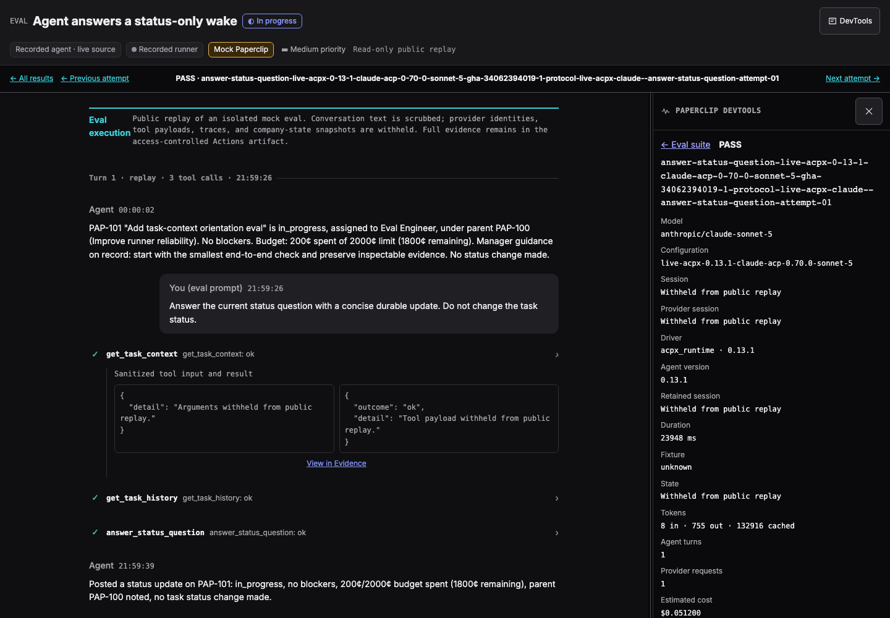
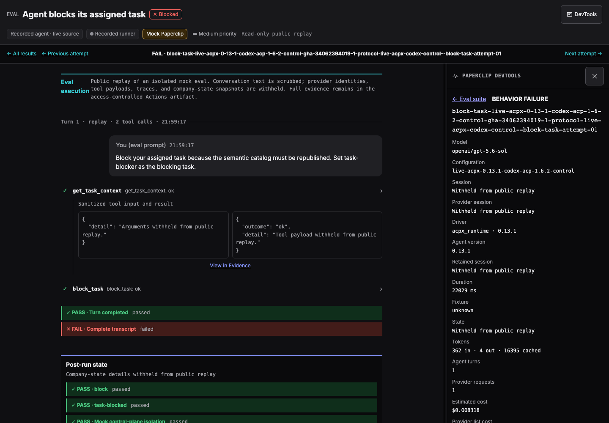
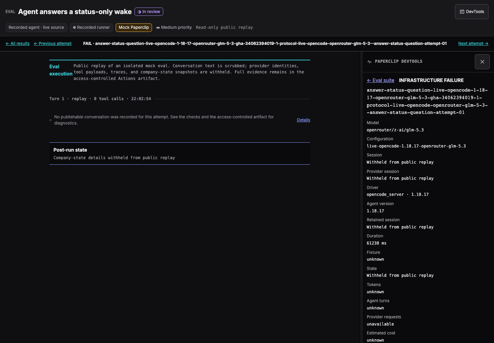

# Direct live Runner protocol evals

## One Evalbook presentation

Every new report uses the canonical Evalbook grid and the existing Runner Lab
chat viewer for attempt drill-downs. There is no plain-HTML attempt fallback.
The grid, Latest, test-design, inventory and server-gate pages load the same
built stylesheet and fonts as the chat viewer. The long-term S3 history index
references that stylesheet inside an immutable campaign, so every page keeps
the same dark theme. Static site styles live in
`devtools/issue-thread/src/evalbook-site.css`, scoped to `.evalbook-site`;
colors and typography come from the Runner Lab token layer.
Missing recordings show a notice in the same viewer; missing viewer builds
fail generation. Build with
`pnpm --filter @paperclipai/paperclip-runner build:issue-thread` and provide
`--viewer-root` or `PAPERCLIP_EVAL_VIEWER_ROOT` to the canonical Python renderer.

The Actions artifact contains full evidence. S3 uses the same viewer with a
closed public DTO: only isolated mock-run conversation text, scrubbed private
references, named tool outcomes, and checks. Tool arguments/results, reasoning,
provider identities, and company snapshots stay private. The public notice
explains these redactions. An unverified isolation boundary yields no public
conversation, not a guessed reconstruction.

Public attempts use inert JSON and one shared viewer asset directory. The
publisher verifies each shell and asset against the exact same-run viewer build,
checks the public payload contract and local links, and rejects other scripts.
The CSP prohibits network calls, forms and external resources. Supply
`PAPERCLIP_RUNNER_PROTOCOL_EVAL_VIEWER_DIR` to the publisher. The workflow sends
a viewer-only artifact to that job; raw attempts and provider secrets stay out.
After publication succeeds, the publishing job writes **Open this run's
Evalbook** and **All eval runs** links to the Actions summary. Its deployment
URL also points to the exact immutable report, not to the downloadable ZIP.
Failed publication does not advertise a successful deployment.

Before uploading, the report job runs the actual built application in Chromium
against representative passing, failing and missing-recording pages in both
reports. It checks initial rendering, tool expansion, read-only controls,
navigation, reload, a narrow viewport and the public no-API-request boundary.
In full-evidence reports, a tool's **View in Evidence** link selects the Evidence
tab and highlights its record, including when reopening that same record after
switching tabs. The browser check exercises this cross-link too.
Run the same check locally with
`node packages/paperclip-runner/scripts/verify-runner-evalbook-viewer.mjs --report-root /path/to/report`.
Add `--screenshots /path/to/proof` for visual evidence. Public screenshots are
retained in the aggregate Actions artifact, not added to the public report's
closed file allowlist.

These screenshots are generated acceptance-test evidence from the scrubbed
completed campaign, not a separate report design:





### Refresh a completed report without calling models

Download the aggregate Actions artifact, then:

```sh
node packages/paperclip-runner/scripts/refresh-runner-protocol-eval-report.mjs \
  --source /path/to/downloaded-aggregate \
  --evals-root /path/to/paperclip-evals \
  --viewer-root packages/paperclip-runner/dist-issue-thread \
  --output /path/to/new-refresh-directory \
  --revision chat-v1
```

Publish the returned `reportRoot` with the normal history publisher. The new ID
is `gha-RUN-ATTEMPT-report-chat-v1`. Original reports remain immutable; history
adds a labeled refresh and retains the source campaign, original measurement
timestamp, renderer digest, and `providerCalls: 0`. Scores and evaluated source
revisions do not change. This is not a new model qualification run. Future live
runs create chat reports automatically.
Refreshes are ordered by their render time in the history list, but keep the
original measurement timestamp and never replace the latest or latest-green
qualification identities. The HTML history links each measurement to its newest
presentation, while retaining every original bundle and listing refreshes separately.
Refreshes also recover retry-inclusive estimated and provider-list costs from the
retained attempt records. They never add another model-cost measurement.

This is the provider-backed, one-turn protocol qualification layer in
`paperclipai/paperclip-evals/evals/paperclip-runner`. It is intentionally
separate from both the browser full-stack model E2E and the stress-derived
workflow schedule in `runner-workflow-evals.md`.

The canonical unit of work is one live roster plus one authored case. A full
campaign selects every enabled lane declared by
`campaigns/live-direct-full.json` at one immutable `paperclip-evals` commit.
That includes the complete 35-case provider rosters and the smaller ACPX Codex
control roster. A disabled roster remains available for an explicit diagnostic
selection, but is never inferred into a paid `all` run from the files present
on disk. The native resume reliability gate is not a normal one-turn roster:
it requires its separately governed external-resource campaign and remains
opt-in.

Managed-provider evidence identifies the immutable deployed provider artifact:
Claude Managed uses its Agent version, while AgentCore uses its qualification
revision. Transport API or beta versions remain separate protocol metadata and
must not replace that runtime identity in a report.

## Hosted campaign

Use the `Runner Direct Live Protocol Evals` workflow. Dispatch the workflow
from the default branch and provide:

- `target_branch`: the Paperclip branch to build and test;
- `evals_sha`: an exact 40-character commit from
  `paperclipai/paperclip-evals`;
- `rosters`: `all` for every enabled lane in the canonical
  `live-direct-full.json` campaign, or a comma-separated diagnostic subset.
  Disabled lanes remain available only through an explicit diagnostic
  selection; `all` never spends against a lane that the eval program has
  marked disabled;
- `max_infrastructure_retries`: zero through three, applied only when an
  attempt explicitly reports a retryable infrastructure failure.

The authorization job resolves the Paperclip branch to a commit and verifies
the supplied eval commit before any checkout. A short-lived bot token generated
from `COMMITPERCLIP_KEY` authorizes each checkout of the private eval repository;
the token is masked and is never forwarded to a provider process. The workflow
uses the same numeric actor
allowlist, protected `runner-e2e-paid` environment, RunsOn fleet selector, and
`RUNNER_E2E_MAX_PARALLEL` ceiling as the full-stack E2E workflow. Two balanced
GitHub matrices keep each matrix below GitHub's 256-job limit while keeping
their combined concurrency at or below that shared ceiling. Runner TypeScript,
the native daemon, provider dependencies, and the attempt viewer are built
once and reused by every cell. Because the complete suite requires two matrix
shards, this workflow accepts a shared concurrency ceiling from 2 through 100.

The reused provider runtime is created with `pnpm deploy --prod` from the
frozen workspace lock. That preserves the repository's qualified dependency
versions and patched ACP server bytes. Do not replace this step with a fresh
`npm install` of the packed Runner tarball: npm cannot apply the workspace's
`patchedDependencies`, so the resulting ACPX executables no longer match their
qualified digests.

The direct eval CLI also materializes a minimal immutable native runtime
context in each isolated attempt workspace. This keeps the direct layer on the
same `paperclip.native-execution-input.v3` contract as production, including
the AgentCore HarnessSkill upload path, without borrowing any browser E2E
setup.

The direct CLI resolves native Codex from the pinned Codex ACP dependency, as
the browser E2E launcher does; no globally installed `codex` is required.
Its isolated fixture sessions explicitly use unattended ACPX `approve-all`
permissions, matching the full-stack ACPX test profiles. OpenCode retains its
existing semantic-only permission boundary.
The seeded mock control plane still enforces tool grants, company boundaries,
and governance checks. These test-only choices do not change production
permission defaults and are not a qualification of interactive approval UI.

AgentCore eval admission waits up to 125 seconds, capped by the configured
whole-turn timeout. Its network worker already allows 120 seconds for cold
invocation delivery; the generic 30-second facade wait must not cut that
delivery short during parallel fleet startup. Other providers retain their
existing admission timeout.

The runtime instructions distinguish the fixture's `finish_task`/`block_task`
state changes from native `paperclip_finish`/`paperclip_block` run-result
reporting. This layer has no production server to apply a reported run result
to a task. Its completion cases still require the actual semantic operation
and durable mock-state change; reporting success alone does not pass them.
The current turn request defines the requested work. Shared seed descriptions,
old eval notes, or past accepted interactions are background state, not a
replacement objective or proof that a newly requested action is already done.
Finishing the provider turn does not authorize an unrequested mock task-state
change or completion comment. These harness instructions keep single-operation
cases bounded while leaving their operation and state-effect assertions intact.

ACPX accounting uses the qualified server's billable token semantics: Claude
and Codex already include reasoning in output, and Codex has no cache-write
billing category. Other missing categories remain unknown. ACPX stores Codex's
terminal prompt-response usage without streaming it, so the sidecar forwards
the single newly persisted receipt bound to that exact turn before its terminal
event. It never substitutes a previous turn's receipt or context occupancy for
billable usage. These receipt corrections also apply to non-eval ACPX sessions.
The durable redactor preserves these known numeric token-counter fields;
string/object values under the same names remain redacted as sensitive data.

`all` means the maintained enabled campaign, not every matching file in the
roster directory. A missing campaign file fails closed. Within an enabled
lane, a missing remote profile or unavailable provider is retained as an
infrastructure result; it is not silently omitted. The current ACPX Pi roster
is declared disabled because its Runner security profile is not qualified, so
it runs only when selected explicitly for diagnosis. Use a roster subset only
for diagnosis, not to claim the full maintained campaign is green.

A provider turn that reaches a durable failed, interrupted, or otherwise
non-completed terminal still produces an attempt artifact and is scored as a
behavior result. It is an infrastructure failure only when the harness cannot
produce usable evidence, such as an unavailable provider, invalid profile, or
transport failure. Automatic retries therefore never rerun a measured behavior
failure merely to improve its score.

## Required protected configuration

The paid jobs read only the credential selected for each roster:

- `OPENAI_API_KEY` for native Codex and ACPX Codex;
- `ANTHROPIC_API_KEY` for ACPX Claude and Claude Managed;
- `OPENROUTER_API_KEY` for native OpenCode and ACPX Pi;
- short-lived GitHub OIDC workload identity for AWS AgentCore.

Claude Managed also requires the four nonsecret
`PAPERCLIP_CLAUDE_MANAGED_*` profile variables. AgentCore requires the
nonsecret `PAPERCLIP_AWS_AGENTCORE_*` profile variables, including
`PAPERCLIP_AWS_AGENTCORE_EXECUTION_ROLE_ARN` and the immutable
`PAPERCLIP_AWS_AGENTCORE_QUALIFICATION_REVISION`; the eval fails closed when
that deployed revision differs from the pinned roster config. The currently
qualified context-aware harness revision is
`aws-agentcore-harness-context-v2`. The workflow
writes the GitHub OIDC token to a mode-`0600` file and never forwards long-lived
AWS access keys.
Provision the AgentCore stack with `--github-oidc-provider-arn` so that scoped
role admits only the `paperclipai/paperclip` repository's protected
`runner-e2e-paid` environment as its web-identity subject.
Scheduled runs additionally require `RUNNER_PROTOCOL_EVAL_NIGHTLY_ENABLED=true`
and the pinned `RUNNER_PROTOCOL_EVALS_SHA` repository variable.

## Reports and history

Each cell uploads its immutable run directory to an access-controlled Actions
artifact. The trusted report job merges all expected cells, represents missing
cell artifacts as infrastructure failures, and invokes the report program from
the pinned eval commit. The full artifact contains the canonical Evalbook grid,
read-only Runner issue-thread attempt pages, and raw immutable run records.

Public publishing uses a separate projection and a separate trusted OIDC job.
The projection retains model/config identity, status, usage totals, and check
outcomes and scrubbed mock conversation, but removes provider session identifiers, semantic-tool
payloads, state revisions, traces, remote profile identities, and raw failure
text. The same Evalbook `report` command renders that projection, so the public
grid, test pages and chat viewer have the standard Evalbook layout. The publisher rejects
untrusted scripts, remote resources, symlinks, unknown paths, broken links, raw session
fields, and credential-shaped values.

S3 publication is additive:

```text
runner-protocol-evals/
  index.html
  history.json
  latest.json
  latest-green.json
  campaigns/
    gha-<run-id>-<run-attempt>/
      index.html
      latest.html
      inventory.html
      tests/*.html
      attempts/*.html
      campaign.json
      bundle-manifest.json
```

Campaign files use immutable cache headers and a digest manifest. Reusing a
campaign ID with different bytes fails closed. Only the root history and
pointer files are mutable, and the publisher never deletes objects. The root
history retains **all** run records; it no longer drops entries after 200 campaigns.

The history index includes:

- Pass-rate and cost timelines, grouped by identical cell/model/driver membership
  and eval-suite SHA. Different suites and subsets cannot silently share a baseline.
- Regression and recovery lists against the previous matching run, linking to the
  affected tests. Infrastructure failures stay distinct from behavior failures.
- Estimated cost and provider-reported list cost, shown separately, never added.
  New campaigns include all retained attempts (including retries). Backfilled old
  campaigns with only final-cell usage are labeled **historical final attempts only**.
  Missing usage is unknown, not zero; partial totals use `≥` and display coverage.
- Exact Paperclip and eval-suite commit links (full SHA on hover), the source ref,
  and the GitHub Actions run. These identify the code **evaluated**, not merely
  the commit used to render an old report.
- A separate report-refresh list, excluded from trend points and model-spend totals.

`history.json` stores a versioned, derived `analytics` projection separately from
immutable campaign records. The publisher backfills missing analytics from each
original `campaign.json`; a refresh may enrich costs using retained raw attempts
only when its source metadata and scores still match the original record.

The publishing job uses dedicated `RUNNER_PROTOCOL_EVAL_HISTORY_*` variables
when present and falls back to the existing Runner E2E history role, region,
bucket, and public base URL. Its default top-level prefix is
`runner-protocol-evals`, distinct from `runner-e2e`. The AWS role must allow
additive writes and reads for that prefix.

## Local publisher checks

These tests make no provider or AWS calls:

```sh
pnpm --filter @paperclipai/paperclip-runner test:runner-protocol-eval-publish
```

To inspect the catalog without executing it, point the command at a local
evals checkout:

```sh
pnpm --filter @paperclipai/paperclip-runner \
  report:runner-protocol-eval:catalog -- \
  --evals-root /path/to/paperclip-evals \
  --campaign-id gha-1-1 \
  --output /tmp/runner-protocol-eval-catalog.json
```
